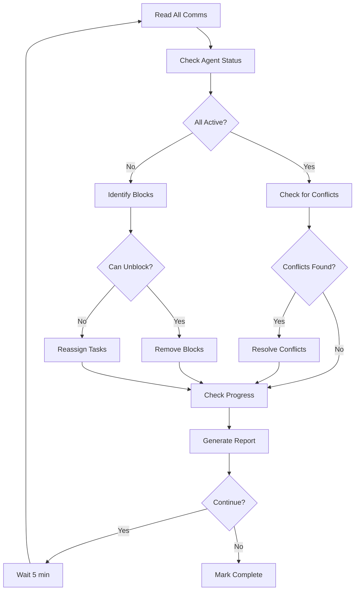

# Sync Parallel Agent Execution

Coordinate and synchronize multiple agents working in parallel, detect conflicts, and reassign work as needed.

## Primary Responsibilities

1. Read all active communication files
2. Identify completed tasks and blockers
3. Detect and resolve conflicts
4. Reassign work if needed
5. Generate comprehensive status reports

## Synchronization Protocol

### Step 1: Gather Agent Status

```bash
# Read all communication files
for comm_file in .squad/comms/agent-*-comm.md; do
  agent_id=$(basename "$comm_file" -comm.md)
  status=$(grep "^Status:" "$comm_file" | tail -1 | cut -d: -f2)
  echo "$agent_id: $status"
done
```

### Step 2: Analyze Current State

```markdown
## Parallel Execution State Analysis

### Active Agents
| Agent ID | Status | Current Task | Progress | Blockers |
|----------|--------|--------------|----------|----------|
| agent-1 | ACTIVE | Dashboard UI | 3/5 tasks | None |
| agent-2 | BLOCKED | API endpoints | 2/4 tasks | Waiting for types |
| agent-3 | ACTIVE | ML pipeline | 1/3 tasks | None |

### File Lock Status
| File | Locked By | Duration | Status |
|------|-----------|----------|--------|
| /frontend/Dashboard.tsx | agent-1 | 2 min | Active |
| /shared/types/metrics.ts | agent-1 | 8 min | ⚠️ Long |

### Completed Tasks
- ✅ Frontend layout structure (agent-1)
- ✅ Database schema (agent-2)
- ✅ Base ML model selection (agent-3)
```

### Step 3: Detect Conflicts

```python
# Conflict detection algorithm
def detect_conflicts():
    conflicts = []
    
    # Check for lock conflicts
    for lock_file in locks:
        if lock_duration > 10_minutes:
            conflicts.append({
                'type': 'STALE_LOCK',
                'file': lock_file,
                'agent': lock_owner,
                'duration': lock_duration
            })
    
    # Check for file conflicts
    modified_files = get_git_modified()
    for file in modified_files:
        owners = get_file_owners(file)
        if len(owners) > 1:
            conflicts.append({
                'type': 'MULTIPLE_MODIFICATIONS',
                'file': file,
                'agents': owners
            })
    
    # Check for dependency blocks
    for agent in blocked_agents:
        if agent.blocked_duration > 15_minutes:
            conflicts.append({
                'type': 'LONG_BLOCK',
                'agent': agent.id,
                'waiting_for': agent.blocker,
                'duration': agent.blocked_duration
            })
    
    return conflicts
```

### Step 4: Resolve Conflicts

```markdown
## Conflict Resolution Actions

### Stale Lock Resolution
1. Check if agent is still active (read recent comm updates)
2. If inactive > 5 min, force unlock
3. Notify agent via comm file
4. Reassign task if agent is unresponsive

### Multiple Modification Resolution
1. Determine intended owner from plan files
2. Revert unauthorized changes
3. Update agent plans to clarify ownership
4. Create sequential handoff if both need access

### Long Block Resolution
1. Check blocking agent's progress
2. If blocking agent is stuck, reassign their task
3. If near completion, instruct waiting agent to work on alternative
4. Create explicit handoff schedule
```

### Step 5: Work Reassignment

```markdown
## Task Reassignment Protocol

### When to Reassign
- Agent unresponsive > 10 minutes
- Agent reports FAILED status
- Critical path blocked > 15 minutes
- More efficient agent becomes available

### Reassignment Process
1. Move incomplete tasks to `.squad/pending-tasks.md`
2. Update original agent's plan (mark as reassigned)
3. Find available agent with right skills
4. Update new agent's plan
5. Notify both agents via comm files

### Reassignment Message
File: .squad/comms/agent-2-comm.md

## Task Reassignment Notice
FROM: Coordinator
TO: agent-2-backend-system-architect
ACTION: New task assigned
TASK: Complete API endpoint for /metrics
REASON: agent-1 blocked on dependencies
FILES: /backend/api/metrics.py
PRIORITY: HIGH
DEADLINE: Next sync cycle
```

### Step 6: Generate Status Reports

```markdown
## Comprehensive Status Report

File: .squad/reports/parallel-status-[timestamp].md

# Parallel Execution Status Report
Generated: 2024-01-20T12:00:00Z

## Executive Summary
- Total Progress: 60% (12/20 tasks)
- Active Agents: 2/3
- Blocked Agents: 1/3
- Conflicts Resolved: 2
- Estimated Completion: 45 minutes

## Agent Performance
| Agent | Tasks Done | In Progress | Blocked | Efficiency |
|-------|------------|-------------|---------|------------|
| agent-1 | 5 | 1 | 0 | 95% |
| agent-2 | 4 | 0 | 1 | 72% |
| agent-3 | 3 | 1 | 0 | 88% |

## File Changes Summary
### Created (15 files)
- /frontend/components/Dashboard.tsx ✅
- /backend/api/metrics.py ⏳
- /ml/models/recommender.py ✅

### Modified (8 files)
- /shared/types/user.ts ✅
- /config/app.config.js ⏳

### Pending (5 files)
- /frontend/hooks/useMetrics.ts
- /backend/services/analytics.py

## Blockers & Resolutions
1. **RESOLVED**: Lock conflict on /shared/types/user.ts
   - Action: Force unlocked after timeout
   
2. **ACTIVE**: agent-2 waiting for type definitions
   - Action: Expedited agent-1's type task
   - ETA: 5 minutes

3. **MONITORING**: Large file edit taking longer than expected
   - File: /frontend/Dashboard.tsx
   - Agent: agent-1
   - Started: 8 minutes ago

## Optimization Opportunities
- Parallelize test writing (currently sequential)
- Split large components into smaller tasks
- Pre-create shared types to reduce blocks

## Next Sync Actions
1. Check agent-1 completes types (5 min)
2. Unblock agent-2 for API work
3. Start integration testing phase
4. Prepare for merge coordination
```

## Sync Commands

### Run Full Sync
```bash
# sync-parallel.sh
#!/bin/bash

echo "Starting parallel sync..."

# Step 1: Check all agents
./check-agent-status.sh

# Step 2: Detect conflicts
./detect-conflicts.sh

# Step 3: Resolve blocks
./resolve-blocks.sh

# Step 4: Reassign if needed
./reassign-tasks.sh

# Step 5: Generate report
./generate-report.sh > ".squad/reports/status-$(date +%Y%m%d-%H%M%S).md"

echo "Sync complete. Report generated."
```

### Quick Status Check
```bash
# quick-status.sh
grep -h "^Status:" .squad/comms/agent-*-comm.md | sort | uniq -c
```

### Force Sync (Emergency)
```bash
# Emergency sync - stops all agents, clears locks, restarts
echo "PAUSE_REQUESTED" > .squad/control/pause.flag
sleep 5
rm -f .squad/locks/*.lock
rm -f .squad/control/pause.flag
echo "RESUME" > .squad/control/resume.flag
```

## Metrics Collection

```markdown
## Performance Metrics to Track

File: .squad/metrics/parallel-performance.md

### Efficiency Metrics
- Task Completion Rate: [completed/total] per hour
- Parallel Efficiency: [parallel time/sequential time]
- Conflict Rate: [conflicts/hour]
- Block Duration: Average time blocked
- Lock Utilization: Average lock hold time

### Agent Metrics
- Tasks per Agent: Distribution of work
- Agent Utilization: Active time percentage
- Agent Conflicts: Conflicts caused by agent
- Agent Dependencies: Cross-agent dependencies

### System Metrics
- File Throughput: Files modified per hour
- Lock Contention: Locks waited for
- Communication Frequency: Updates per agent
- Sync Overhead: Time spent in sync
```

## Sync Decision Tree



## Best Practices

### Sync Frequency
- Normal: Every 5 minutes
- High Activity: Every 2 minutes
- Low Activity: Every 10 minutes
- Critical Phase: Continuous monitoring

### Communication Standards
- Always timestamp updates
- Include specific file names
- Specify exact blockers
- Estimate completion times
- Document handoff requirements

### Conflict Prevention
- Clear ownership boundaries
- Minimal shared file editing
- Quick lock release
- Frequent small commits
- Explicit dependencies

### Performance Optimization
- Batch related tasks
- Minimize cross-agent dependencies
- Parallelize independent features
- Pre-create shared interfaces
- Use read-only access when possible