# Large Project Parallel Execution Example

## Scenario: E-Commerce Platform MVP

A complex project requiring 5-7 parallel agents based on task independence analysis.

## PRD Analysis

### Features Required
1. **User Management System**
   - Registration/Login (Frontend + Backend)
   - Profile management
   - OAuth integration

2. **Product Catalog**
   - Product listing UI
   - Search/Filter functionality
   - Admin CRUD operations

3. **Shopping Cart**
   - Cart state management
   - Price calculations
   - Inventory checks

4. **Payment Processing**
   - Checkout flow
   - Payment gateway integration
   - Order confirmation

5. **ML Recommendations**
   - Product recommendations
   - Personalization engine
   - A/B testing framework

## Dependency Analysis Results

```yaml
Independence Analysis:
  independent_chains: 5
  max_parallel_tasks: 7
  shared_files: ["/types/user.ts", "/config/api.ts"]
  blocking_dependencies: ["database_schema -> all_apis"]
  task_types:
    frontend: 12
    backend: 10
    database: 3
    ml: 4
    infrastructure: 2

Recommendation: 5 agents (optimal for this project)
```

## Why 5 Agents?

### Task Independence Graph
```
Level 0 (Can start immediately - 5 parallel):
├── Database Schema (Agent 1)
├── UI Component Library (Agent 2)
├── ML Model Training (Agent 3)
├── Payment Gateway Setup (Agent 4)
└── Infrastructure Config (Agent 5)

Level 1 (After Level 0 - 4 parallel):
├── User API (Agent 1)
├── Product API (Agent 1)
├── Cart Frontend (Agent 2)
└── Search Frontend (Agent 2)

Level 2 (After Level 1 - 3 parallel):
├── Integration Tests (Agent 4)
├── ML Integration (Agent 3)
└── Admin Dashboard (Agent 2)
```

## Agent Allocation

### Agent 1: Backend System Architect (Heavy)
**Tasks**: 7 tasks
- Database schema design
- User management API
- Product catalog API
- Order processing logic
**Files**: `/backend/**`, `/database/**`

### Agent 2: Frontend UI Developer (Heavy)
**Tasks**: 6 tasks
- Component library setup
- Product listing UI
- Shopping cart interface
- Admin dashboard
**Files**: `/frontend/**`, `/components/**`

### Agent 3: AI/ML Engineer (Moderate)
**Tasks**: 4 tasks
- Recommendation model training
- Personalization engine
- ML pipeline setup
- A/B testing framework
**Files**: `/ml/**`, `/models/**`

### Agent 4: Frontend UI Developer #2 (Moderate)
**Tasks**: 4 tasks
- User registration/login UI
- Checkout flow
- Payment integration UI
- Order confirmation pages
**Files**: `/frontend/auth/**`, `/frontend/checkout/**`

### Agent 5: Backend System Architect #2 (Light)
**Tasks**: 3 tasks
- Payment gateway integration
- Infrastructure configuration
- DevOps setup
**Files**: `/infrastructure/**`, `/backend/payments/**`

## Execution Timeline

```mermaid
gantt
    title 5-Agent Parallel Execution
    dateFormat HH:mm
    
    section Agent-1 Backend
    DB Schema :a1t1, 00:00, 30m
    User API :a1t2, after a1t1, 45m
    Product API :a1t3, after a1t2, 45m
    Order Logic :a1t4, after a1t3, 30m
    
    section Agent-2 Frontend
    Component Lib :a2t1, 00:00, 30m
    Product UI :a2t2, after a2t1, 45m
    Cart UI :a2t3, after a2t2, 45m
    Admin UI :a2t4, after a2t3, 30m
    
    section Agent-3 ML
    Model Training :a3t1, 00:00, 60m
    Personalization :a3t2, after a3t1, 45m
    ML Integration :a3t3, after a3t2, 45m
    
    section Agent-4 Frontend-2
    Auth UI :a4t1, 00:00, 45m
    Checkout Flow :a4t2, after a4t1, 60m
    Payment UI :a4t3, after a4t2, 45m
    
    section Agent-5 Backend-2
    Infrastructure :a5t1, 00:00, 30m
    Payment Gateway :a5t2, after a5t1, 60m
    DevOps Setup :a5t3, after a5t2, 60m
```



## Efficiency Comparison

| Configuration | Agents | Time | Efficiency | Coordination |
|--------------|--------|------|------------|--------------|
| Sequential | 1 | 12 hours | Baseline | None |
| Minimal | 2 | 6.5 hours | 46% | Low |
| Moderate | 3 | 4.5 hours | 62% | Moderate |
| **Optimal** | **5** | **2.5 hours** | **79%** | **High** |
| Excessive | 7 | 2.3 hours | 81% | Very High |
| Maximum | 9 | 2.2 hours | 82% | Excessive |

## Key Insights

### Why Not More Agents?
- **6+ agents**: Only 2% additional efficiency gain
- **Coordination overhead**: Exponential increase after 5 agents
- **Lock contention**: Shared files become bottlenecks
- **Communication complexity**: O(n²) message exchanges

### Success Factors for 5 Agents
1. **Clear domain boundaries**: Each agent owns specific directories
2. **Minimal shared files**: Only 2 type definition files
3. **Staged dependencies**: Level-based execution prevents blocks
4. **Mixed workloads**: Heavy, moderate, and light agents balance naturally

## Monitoring Dashboard for 5 Agents

```bash
#!/bin/bash
# monitor-5-agents.sh

echo "===== 5-AGENT EXECUTION MONITOR ====="
echo "Agents Status:"
for i in 1 2 3 4 5; do
  status=$(grep "Status:" .squad/comms/agent-$i-comm.md | tail -1)
  echo "Agent-$i: $status"
done

echo -e "\nWork Distribution:"
echo "Agent-1 (Backend-Heavy): ████████ 8 tasks"
echo "Agent-2 (Frontend-Heavy): ██████ 6 tasks"
echo "Agent-3 (ML-Moderate): ████ 4 tasks"
echo "Agent-4 (Frontend-Moderate): ████ 4 tasks"
echo "Agent-5 (Backend-Light): ███ 3 tasks"

echo -e "\nCritical Path:"
echo "DB Schema -> APIs -> Integration -> Deployment"
echo "Current Phase: $(cat .squad/metrics/current-phase.txt)"
```

## Lessons Learned

### What Works at Scale
- **Domain-based allocation**: Frontend vs Backend vs ML
- **Workload balancing**: Mix heavy and light agents
- **Clear ownership**: Each agent owns entire directories
- **Phased execution**: Level-based task scheduling

### What Doesn't Scale
- **Fine-grained parallelism**: Too many small tasks
- **Shared state management**: Avoid shared files
- **Over-optimization**: 7+ agents rarely worth it
- **Flat coordination**: Need hierarchical structure for 6+ agents