# Parallel Execution Test Scenario

## Test Overview
This test validates the parallel execution framework by implementing a User Analytics Dashboard with 3 agents working simultaneously.

## Test Configuration

### Agents
1. **Agent 1**: frontend-ui-developer (Dashboard UI)
2. **Agent 2**: backend-system-architect (API Backend)
3. **Agent 3**: ai-ml-engineer (ML Models)

### Feature
**User Analytics Dashboard** - A real-time dashboard with:
- Frontend: React components with WebSocket updates
- Backend: FastAPI endpoints with data export
- ML: Anomaly detection and trend prediction

## Test Execution Steps

### Step 1: Initialize Test Environment
```bash
cd .squad/examples/parallel-test
mkdir -p frontend/components frontend/hooks frontend/styles
mkdir -p backend/api backend/models backend/services backend/utils
mkdir -p ml/models ml/services ml/prompts
mkdir -p shared/types
mkdir -p .squad/locks .squad/comms .squad/logs
```

### Step 2: Prepare Allocation
```bash
# Copy PRD to active location
cp feature-prd.md ../../../.squad/feature-prd.md

# Copy agent plans
cp agent-1-plan.md ../../../.squad/parallel-plans/
cp agent-2-plan.md ../../../.squad/parallel-plans/
cp agent-3-plan.md ../../../.squad/parallel-plans/
```

### Step 3: Start Parallel Execution

**Terminal 1 - Frontend Agent:**
```bash
export AGENT_ID="agent-1-frontend-ui-developer"
export AGENT_PLAN=".squad/parallel-plans/agent-1-plan.md"
# Read plan and start creating types immediately
```

**Terminal 2 - Backend Agent:**
```bash
export AGENT_ID="agent-2-backend-system-architect"
export AGENT_PLAN=".squad/parallel-plans/agent-2-plan.md"
# Start with database schema while waiting for types
```

**Terminal 3 - ML Agent:**
```bash
export AGENT_ID="agent-3-ai-ml-engineer"
export AGENT_PLAN=".squad/parallel-plans/agent-3-plan.md"
# Begin anomaly detector immediately
```

### Step 4: Monitor Execution
```bash
# Terminal 4 - Monitoring
watch -n 5 'grep "Status:" .squad/comms/agent-*-comm.md'
```

## Expected Timeline

```mermaid
gantt
    title Parallel Execution Timeline
    dateFormat HH:mm
    section Agent-1 Frontend
    Create Types :types, 00:00, 10m
    Dashboard Layout :dash, after types, 15m
    Metric Cards :cards, after dash, 15m
    WebSocket Hook :hook, after cards, 10m
    Styling :style, after hook, 10m
    
    section Agent-2 Backend
    DB Schema :schema, 00:00, 10m
    Wait for Types :crit, wait, 00:00, 10m
    REST API :api, after wait, 20m
    Analytics Service :service, after api, 15m
    Export Utility :export, after service, 10m
    
    section Agent-3 ML
    Anomaly Detector :anomaly, 00:00, 20m
    Trend Predictor :trend, after anomaly, 20m
    Insights Service :insights, after trend, 15m
    Analysis Prompts :prompts, after insights, 5m
```



## Success Criteria

### Parallel Execution Metrics
- [ ] All 3 agents start within 1 minute
- [ ] Type creation completes in 10 minutes
- [ ] No file conflicts occur
- [ ] All agents complete within 60 minutes
- [ ] Parallel efficiency > 65%

### File Creation Validation
```bash
# Check all expected files were created
find . -type f -name "*.tsx" -o -name "*.ts" -o -name "*.py" -o -name "*.css" | wc -l
# Expected: 14 files

# Verify no lock conflicts
ls .squad/locks/*.lock 2>/dev/null | wc -l
# Expected: 0 (all locks released)
```

### Communication Validation
```bash
# Check all agents reported completion
grep "Status: COMPLETE" .squad/comms/agent-*-comm.md | wc -l
# Expected: 3

# Verify handoffs occurred
grep "Handoff" .squad/comms/agent-*-comm.md
# Expected: At least 2 handoffs
```

## Test Scenarios

### Scenario 1: Happy Path
- All agents work without conflicts
- Types created on time
- Parallel execution completes in 60 min
- **Expected Result**: SUCCESS

### Scenario 2: Type Creation Delay
- Agent-1 takes 20 min for types (delayed)
- Agent-2 and Agent-3 continue with independent work
- **Expected Result**: SUCCESS with slight delay

### Scenario 3: Lock Conflict
- Agent-1 and Agent-2 both try to modify config
- Lock mechanism prevents conflict
- One agent waits, then proceeds
- **Expected Result**: SUCCESS with conflict resolution

### Scenario 4: Agent Failure
- Agent-3 crashes at 30 minutes
- Coordinator detects via stale communication
- Work reassigned to available agent
- **Expected Result**: RECOVERY and SUCCESS

## Monitoring Commands

### Real-time Status
```bash
while true; do
  clear
  echo "=== Parallel Execution Status ==="
  echo "Time: $(date +%H:%M:%S)"
  echo ""
  echo "Agent Status:"
  grep -h "Status:" .squad/comms/agent-*-comm.md
  echo ""
  echo "Files Created:"
  find . -name "*.tsx" -o -name "*.ts" -o -name "*.py" | wc -l
  echo ""
  echo "Active Locks:"
  ls .squad/locks/*.lock 2>/dev/null || echo "None"
  sleep 5
done
```

### Performance Report
```bash
cat > generate-report.sh << 'EOF'
#!/bin/bash
echo "# Parallel Execution Report"
echo "## Timeline"
echo "Start: $(head -1 .squad/logs/execution.log)"
echo "End: $(tail -1 .squad/logs/execution.log)"
echo ""
echo "## Agent Performance"
for i in 1 2 3; do
  echo "### Agent $i"
  grep "Tasks Completed" .squad/comms/agent-$i-comm.md | tail -1
done
echo ""
echo "## Files Created"
find . -type f \( -name "*.tsx" -o -name "*.ts" -o -name "*.py" \) -exec basename {} \; | sort
EOF
chmod +x generate-report.sh
```

## Cleanup
```bash
# After test completion
rm -rf frontend backend ml shared
rm -f .squad/locks/*.lock
rm -f .squad/comms/agent-*-comm.md
rm -f .squad/parallel-plans/agent-*-plan.md
```

## Lessons Learned Template

After test execution, document:

1. **What Worked Well**
   - Parallel execution efficiency
   - Lock mechanism effectiveness
   - Communication protocol

2. **Issues Encountered**
   - Any conflicts or blocks
   - Performance bottlenecks
   - Coordination challenges

3. **Improvements Needed**
   - Framework enhancements
   - Better conflict prevention
   - Optimization opportunities

4. **Metrics Achieved**
   - Actual vs expected timeline
   - Parallel efficiency percentage
   - Conflict rate