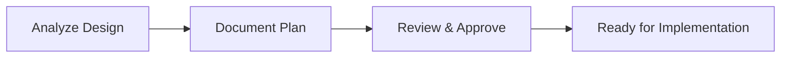
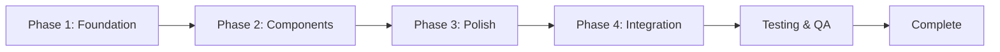
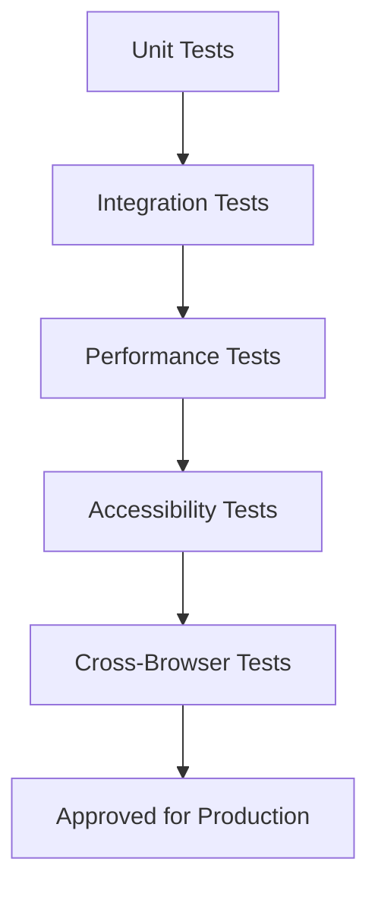

# Design Transition Documentation

**Purpose**: This folder contains planning and implementation documentation for transitioning DevPrep AI's UI design to the glassmorphism aesthetic.

---

## 📁 Contents

### Planning Documents

#### [`home-page-glassmorphism-plan.md`](./home-page-glassmorphism-plan.md)
**Status**: ✅ Complete - Ready for Implementation
**Version**: 1.0.0
**Date**: October 9, 2025

Comprehensive transition plan for the home page, including:
- Phase-by-phase implementation breakdown
- Effort estimates (22-29 hours total)
- Component-level task details
- Design system integration strategy
- Risk mitigation and testing plans

**Quick Stats**:
- **Phases**: 4 (Foundation → Components → Polish → Integration)
- **Components**: 7 (Header, Hero, Features, HowItWorks, TechStack, CTA, Footer)
- **Estimated Time**: 3-4 days
- **Complexity**: Low-Medium

---

## 🎯 Design Vision

### Glassmorphism Aesthetic
DevPrep AI is transitioning to a **glassmorphism design language** characterized by:

1. **Semi-transparent surfaces** with backdrop blur effects
2. **Layered depth** using shadows and lighting
3. **Neon glow accents** on interactive elements
4. **Animated gradients** in backgrounds
5. **Smooth transitions** and micro-interactions

### Design References
All design prototypes are located in:
```
.superdesign/design_iterations/
├── glassmorphism_home_1.html              # Home page (CURRENT FOCUS)
├── glassmorphism_practice_setup_1.html    # Practice wizard
├── glassmorphism_session_coding_1.html    # Coding session
├── glassmorphism_session_opentext_1.html  # Open text session
├── glassmorphism_session_split_1.html     # Split pane layout
├── glassmorphism_wizard_step1_1.html      # Wizard step 1
├── glassmorphism_wizard_step2_1.html      # Wizard step 2
├── glassmorphism_wizard_step5_1.html      # Wizard step 5
└── themes/
    └── glassmorphism.css                  # Theme styles
```

---

## 📊 Implementation Status

### Current Progress

| Page/Section | Status | Estimated Effort | Priority |
|--------------|--------|------------------|----------|
| **Home Page** | 📋 Planning Complete | 22-29 hours | P0 |
| Practice Wizard | 📝 Planning | TBD | P1 |
| Session Pages | 📝 Planning | TBD | P1 |
| Results Pages | 📝 Planning | TBD | P2 |
| Profile Page | 📝 Planning | TBD | P2 |

**Legend**:
- 📋 Planning Complete
- 🚧 In Progress
- ✅ Complete
- 📝 Planning

### Phase Tracking (Home Page)

| Phase | Description | Status | Time Spent |
|-------|-------------|--------|------------|
| Phase 1 | Foundation (theme file + globals) | 📋 Ready | - |
| Phase 2 | Component Enhancement | 📋 Ready | - |
| Phase 3 | Polish & Animations | 📋 Ready | - |
| Phase 4 | Integration & Testing | 📋 Ready | - |

---

## 🎨 Design Principles

### 1. Progressive Enhancement
**Don't break existing functionality** - Layer glassmorphism effects on top of current design without structural changes.

✅ **Good**:
```tsx
// Add glass effect to existing card
<div className="card-standard glass-card">
```

❌ **Bad**:
```tsx
// Rebuild entire component
<GlassCard>
  <NewStructure>...</NewStructure>
</GlassCard>
```

### 2. Reuse Existing Design System
**No new color variables needed** - Map design prototype colors to existing palette:

| Prototype | Existing Variable | HSL |
|-----------|-------------------|-----|
| #7877c6 (Purple) | `--brand-primary` | 236 86% 63% |
| #ff77c6 (Pink) | `--brand-secondary` | 259 100% 71% |
| #78dbff (Blue) | `--brand-accent` | 200 98% 39% |

### 3. Mobile-First Responsive
**Start with mobile, enhance for desktop**:
```css
/* Mobile base */
.glass-card {
  backdrop-filter: blur(10px);
}

/* Desktop enhancement */
@media (min-width: 768px) {
  .glass-card {
    backdrop-filter: blur(20px);
  }
}
```

### 4. Accessibility First
**Maintain WCAG 2.1 AA compliance**:
- Text contrast ≥ 4.5:1
- Focus indicators visible
- Keyboard navigation
- Reduced motion support
- Screen reader compatibility

### 5. Performance Budget
**Keep pages fast**:
- Lighthouse Performance ≥ 90
- LCP < 2.5s
- FID < 100ms
- CLS < 0.1

---

## 🛠 Implementation Guidelines

### File Structure
```
frontend/src/
├── styles/
│   ├── globals.css                  # Existing design system
│   └── glassmorphism.css            # New theme file
├── modules/home/components/         # Home page components
├── shared/ui/                       # Reusable UI components
└── app/page.tsx                     # Home page entry
```

### CSS Organization
**Glassmorphism styles in separate file** for easy theming:

```css
/* frontend/src/styles/glassmorphism.css */

/* Glass Effects */
.glass-card { }
.glass-header { }

/* Glow Effects */
.neon-glow { }
.neon-glow-pink { }
.neon-glow-blue { }

/* Button Variants */
.btn-glass { }

/* Text Effects */
.gradient-text { }

/* Animations */
.fade-in { }
.fade-in-delay-1 { }
```

### Component Enhancement Pattern
**3-step process for each component**:

1. **Add glass effect wrapper**:
   ```tsx
   <div className="glass-card">
     {/* existing content */}
   </div>
   ```

2. **Enhance interactive elements**:
   ```tsx
   <button className="btn-primary glass-effect">
     {/* existing content */}
   </button>
   ```

3. **Add animations**:
   ```tsx
   <div className="fade-in fade-in-delay-1">
     {/* existing content */}
   </div>
   ```

---

## ⚠️ Common Pitfalls

### 1. Don't Override Existing Styles
❌ **Bad**:
```css
.btn-primary {
  background: /* completely new gradient */
}
```

✅ **Good**:
```css
.btn-primary.glass-effect {
  backdrop-filter: blur(10px);
  /* enhance, don't replace */
}
```

### 2. Don't Add Unnecessary Dependencies
❌ **Bad**:
```bash
npm install glass-ui-library
```

✅ **Good**:
```css
/* Use CSS only */
.glass-card {
  backdrop-filter: blur(20px);
}
```

### 3. Don't Ignore Performance
❌ **Bad**:
```css
* {
  backdrop-filter: blur(20px);
}
```

✅ **Good**:
```css
.glass-card {
  backdrop-filter: blur(20px);
  will-change: backdrop-filter;
}

@media (prefers-reduced-motion: reduce) {
  .glass-card {
    backdrop-filter: none;
  }
}
```

### 4. Don't Break Responsive Design
❌ **Bad**:
```tsx
<div className="hidden md:flex">
  {/* Critical content */}
</div>
```

✅ **Good**:
```tsx
<div className="grid grid-cols-1 md:grid-cols-3">
  {/* Responsive grid */}
</div>
```

---

## 📝 Documentation Standards

### Planning Document Template
Each page transition should have:

1. **Executive Summary** (goals, principles)
2. **Current State Analysis** (existing files, components)
3. **Design Reference Analysis** (prototype breakdown)
4. **Implementation Plan** (phased approach)
5. **Effort Summary** (time estimates)
6. **Risk Mitigation** (potential issues + solutions)
7. **Testing Strategy** (unit, integration, performance)
8. **Success Criteria** (measurable outcomes)

### Naming Convention
```
{page-name}-glassmorphism-plan.md
```

Examples:
- `home-page-glassmorphism-plan.md` ✅
- `practice-wizard-glassmorphism-plan.md` (future)
- `session-page-glassmorphism-plan.md` (future)

---

## 🔄 Workflow

### 1. Planning Phase


### 2. Implementation Phase


### 3. Testing Phase


---

## 📚 Related Documentation

### Design System
- [`Docs/design-system.md`](../design-system.md) - Current design system
- [`.superdesign/design_iterations/README.md`](../../.superdesign/design_iterations/README.md) - Design prototypes

### Architecture
- [`Docs/technical-architecture.md`](../technical-architecture.md) - System architecture
- [`Docs/code-standards.md`](../code-standards.md) - Coding standards
- [`CLAUDE.md`](../../CLAUDE.md) - Project overview

### User Experience
- [`Docs/user-flows.md`](../user-flows.md) - User journey maps
- [`Docs/PRD.md`](../PRD.md) - Product requirements

---

## 🎓 Learning Resources

### Glassmorphism Design
- [Glassmorphism in User Interfaces](https://uxdesign.cc/glassmorphism-in-user-interfaces-1f39bb1308c9)
- [CSS Tricks: Backdrop Filter](https://css-tricks.com/almanac/properties/b/backdrop-filter/)

### Performance
- [Web.dev: Core Web Vitals](https://web.dev/vitals/)
- [Lighthouse Performance Scoring](https://web.dev/performance-scoring/)

### Accessibility
- [WCAG 2.1 Guidelines](https://www.w3.org/WAI/WCAG21/quickref/)
- [MDN: Accessibility](https://developer.mozilla.org/en-US/docs/Web/Accessibility)

---

## 📞 Contact

**For questions about design transitions**:
1. Review planning documents in this folder
2. Check design prototypes in `.superdesign/design_iterations/`
3. Reference existing design system in `Docs/design-system.md`

**Implementation tracking**:
- Use TodoWrite tool for task management
- Update planning documents with status
- Document deviations or issues

---

**Last Updated**: October 9, 2025
**Next Milestone**: Complete Home Page Implementation (3-4 days)
