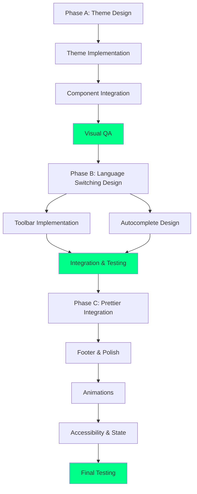

# Answer Panel Enhancement - Agent Delegation & Sprint Plan
**Date**: January 25, 2025
**Sprint Duration**: 3 weeks (15 working days)
**Strategy**: Hybrid 3-phase progressive delivery
**Design Doc**: `2025-01-25-answer-panel-enhancement-design.md`

---

## Executive Summary

This document provides the **agent delegation matrix** and **sprint plan** for implementing the Answer Panel enhancement. Each task is assigned to a specialized agent based on their capabilities, ensuring optimal execution and quality.

**Key Principles**:
- **Parallel execution** where possible (maximize velocity)
- **Progressive delivery** (ship value each week)
- **Quality gates** (reviews between phases)
- **Agent expertise** (right agent for the right task)

---

## Agent Capabilities Reference

| Agent | Specialization | When to Use |
|-------|----------------|-------------|
| **rapid-ui-designer** | UI/UX design, mockups, Tailwind | Visual design, prototyping, CSS extraction |
| **frontend-ui-developer** | React/TypeScript, components, hooks | Component implementation, state management |
| **code-quality-reviewer** | Testing, linting, performance, security | Code review, testing, quality assurance |
| **whimsy-injector** | Micro-interactions, animations, delight | Polish, animations, delightful UX |
| **ai-ml-engineer** | LLM integration, prompt engineering | Smart autocomplete patterns, AI features |
| **backend-system-architect** | Architecture, data flow, scalability | State management design, system architecture |
| **sprint-prioritizer** | Planning, prioritization, trade-offs | Sprint planning, MoSCoW, velocity tracking |
| **studio-coach** | Orchestration, multi-agent coordination | Phase coordination, handoffs, integration |
| **ux-researcher** | User research, usability testing | User testing, accessibility validation |

---

## Phase A: Theme + Syntax Highlighting (Week 1)

**Goal**: Visual impact - editor matches glassmorphism design system
**Deliverable**: Themed CodeMirror editor with enhanced syntax highlighting
**Success Metric**: Theme colors use brand palette, glow effects visible

### Task Breakdown

#### A1: Design & Specification (Days 1-2)

| # | Task | Agent | Effort | Dependencies | Deliverable |
|---|------|-------|--------|--------------|-------------|
| A1.1 | Audit current CodeMirror theme | **rapid-ui-designer** | 2h | None | Theme gap analysis document |
| A1.2 | Extract CSS from prototype | **rapid-ui-designer** | 3h | A1.1 | CSS specification file |
| A1.3 | Map CSS variables to theme | **rapid-ui-designer** | 2h | A1.2 | Color mapping document |
| A1.4 | Design syntax highlighting scheme | **rapid-ui-designer** | 3h | A1.3 | Syntax color specifications |
| A1.5 | Create visual mockups | **rapid-ui-designer** | 2h | A1.4 | Figma/HTML mockups |

**Subtotal**: 12h (1.5 days) | **Agent**: rapid-ui-designer

**Handoff**: Design specs → frontend-ui-developer

---

#### A2: Theme Implementation (Days 2-3)

| # | Task | Agent | Effort | Dependencies | Deliverable |
|---|------|-------|--------|--------------|-------------|
| A2.1 | Create `codemirror-glassmorphism.ts` | **frontend-ui-developer** | 4h | A1.5 | Theme file with base styles |
| A2.2 | Implement syntax highlighting rules | **frontend-ui-developer** | 4h | A2.1 | Complete syntax theme |
| A2.3 | Add glow effects (selection, cursor, brackets) | **frontend-ui-developer** | 3h | A2.2 | Enhanced theme with effects |
| A2.4 | Create custom scrollbar styles | **frontend-ui-developer** | 1h | A2.1 | Glassmorphism scrollbar |
| A2.5 | Test theme with sample code | **frontend-ui-developer** | 2h | A2.3 | Theme validation |

**Subtotal**: 14h (1.75 days) | **Agent**: frontend-ui-developer

**Handoff**: Theme implementation → Component integration

---

#### A3: Component Integration (Days 3-4)

| # | Task | Agent | Effort | Dependencies | Deliverable |
|---|------|-------|--------|--------------|-------------|
| A3.1 | Build `AnswerPanelContainer.tsx` | **frontend-ui-developer** | 3h | None | Layout container component |
| A3.2 | Build `CodeAnswerEditor.tsx` wrapper | **frontend-ui-developer** | 4h | A2.5, A3.1 | Enhanced CodeMirror wrapper |
| A3.3 | Integrate theme into editor | **frontend-ui-developer** | 2h | A2.5, A3.2 | Themed editor component |
| A3.4 | Add container glassmorphism styling | **frontend-ui-developer** | 2h | A3.1 | Styled container |
| A3.5 | Update `useCodeMirrorConfig` hook | **frontend-ui-developer** | 2h | A2.5 | Updated hook with new theme |

**Subtotal**: 13h (1.6 days) | **Agent**: frontend-ui-developer

**Handoff**: Components → Visual QA

---

#### A4: Visual QA & Polish (Day 5)

| # | Task | Agent | Effort | Dependencies | Deliverable |
|---|------|-------|--------|--------------|-------------|
| A4.1 | Cross-browser visual testing | **code-quality-reviewer** | 2h | A3.5 | Browser compatibility report |
| A4.2 | Mobile responsive testing | **code-quality-reviewer** | 2h | A3.5 | Mobile QA report |
| A4.3 | Design review (theme accuracy) | **rapid-ui-designer** | 2h | A3.5 | Design approval or feedback |
| A4.4 | Adjust glow effects and shadows | **frontend-ui-developer** | 2h | A4.3 | Refined theme |
| A4.5 | Final polish and commit | **frontend-ui-developer** | 1h | A4.4 | Phase A complete |

**Subtotal**: 9h (1.1 days) | **Agents**: code-quality-reviewer, rapid-ui-designer, frontend-ui-developer

---

### Phase A Summary

| Metric | Value |
|--------|-------|
| **Total Effort** | 48h (6 days) |
| **Calendar Time** | 5 days (with parallel work) |
| **Primary Agents** | rapid-ui-designer (12h), frontend-ui-developer (31h), code-quality-reviewer (4h) |
| **Deliverables** | Theme file, 2 components, QA reports |
| **Success Gate** | Design approval + visual QA passed |

---

## Phase B: Language Switching + Autocomplete (Week 2)

**Goal**: UX features - language switching + smart autocomplete
**Deliverable**: Language selector UI + context-aware code suggestions
**Success Metric**: Language switching works, autocomplete shows relevant suggestions >80% of time

### Task Breakdown

#### B1: Language Switching Design (Days 6-7)

| # | Task | Agent | Effort | Dependencies | Deliverable |
|---|------|-------|--------|--------------|-------------|
| B1.1 | Design language selector UI/UX | **rapid-ui-designer** | 3h | Phase A complete | Language selector mockup |
| B1.2 | Design dropdown glassmorphism style | **rapid-ui-designer** | 2h | B1.1 | Styled dropdown spec |
| B1.3 | Design language badge component | **rapid-ui-designer** | 1h | B1.1 | Badge design spec |
| B1.4 | Define transition animations | **whimsy-injector** | 2h | B1.1 | Animation specifications |
| B1.5 | Create language switching flow | **ux-researcher** | 2h | B1.1 | User flow diagram |

**Subtotal**: 10h (1.25 days) | **Agents**: rapid-ui-designer (6h), whimsy-injector (2h), ux-researcher (2h)

**Handoff**: Design → Implementation

---

#### B2: Toolbar Implementation (Days 7-8)

| # | Task | Agent | Effort | Dependencies | Deliverable |
|---|------|-------|--------|--------------|-------------|
| B2.1 | Build `EditorToolbar.tsx` structure | **frontend-ui-developer** | 3h | B1.5 | Toolbar component skeleton |
| B2.2 | Implement language selector dropdown | **frontend-ui-developer** | 4h | B1.2, B2.1 | Working dropdown |
| B2.3 | Add language badge display | **frontend-ui-developer** | 2h | B1.3, B2.1 | Language badge component |
| B2.4 | Implement language switching logic | **frontend-ui-developer** | 3h | B2.2 | Language switching functionality |
| B2.5 | Add code preservation on switch | **frontend-ui-developer** | 2h | B2.4 | Safe language switching |
| B2.6 | Create warning modal (incompatible syntax) | **frontend-ui-developer** | 2h | B2.5 | Warning modal component |

**Subtotal**: 16h (2 days) | **Agent**: frontend-ui-developer

**Handoff**: Toolbar → Autocomplete

---

#### B3: Smart Autocomplete (Days 8-9)

| # | Task | Agent | Effort | Dependencies | Deliverable |
|---|------|-------|--------|--------------|-------------|
| B3.1 | Design autocomplete patterns | **ai-ml-engineer** | 4h | None | Pattern specifications |
| B3.2 | Create React/TS completion library | **ai-ml-engineer** | 4h | B3.1 | Completion patterns (React hooks, Array methods) |
| B3.3 | Create Python completion patterns | **ai-ml-engineer** | 2h | B3.1 | Python patterns (basic) |
| B3.4 | Implement `useAutoComplete.ts` hook | **frontend-ui-developer** | 4h | B3.2 | Autocomplete hook |
| B3.5 | Integrate autocomplete into editor | **frontend-ui-developer** | 3h | B3.4 | Working autocomplete |
| B3.6 | Style autocomplete popup | **frontend-ui-developer** | 2h | B3.5 | Glassmorphism autocomplete UI |

**Subtotal**: 19h (2.4 days) | **Agents**: ai-ml-engineer (10h), frontend-ui-developer (9h)

**Handoff**: Autocomplete → Integration testing

---

#### B4: Integration & Testing (Day 10)

| # | Task | Agent | Effort | Dependencies | Deliverable |
|---|------|-------|--------|--------------|-------------|
| B4.1 | Connect toolbar to editor | **frontend-ui-developer** | 2h | B2.6, B3.6 | Integrated components |
| B4.2 | Test language switching flow | **code-quality-reviewer** | 2h | B4.1 | Language switching test report |
| B4.3 | Test autocomplete accuracy | **code-quality-reviewer** | 3h | B4.1 | Autocomplete accuracy report |
| B4.4 | User testing (language switching UX) | **ux-researcher** | 2h | B4.1 | User feedback report |
| B4.5 | Fix bugs and polish | **frontend-ui-developer** | 2h | B4.2, B4.3, B4.4 | Phase B complete |

**Subtotal**: 11h (1.4 days) | **Agents**: frontend-ui-developer (4h), code-quality-reviewer (5h), ux-researcher (2h)

---

### Phase B Summary

| Metric | Value |
|--------|-------|
| **Total Effort** | 56h (7 days) |
| **Calendar Time** | 5 days (with parallel work) |
| **Primary Agents** | frontend-ui-developer (29h), ai-ml-engineer (10h), code-quality-reviewer (5h), rapid-ui-designer (6h), ux-researcher (4h), whimsy-injector (2h) |
| **Deliverables** | Toolbar component, autocomplete hook, test reports |
| **Success Gate** | Language switching works + autocomplete >80% accurate |

---

## Phase C: Code Formatting + Polish (Week 3)

**Goal**: Quality improvements - formatting + full polish
**Deliverable**: Prettier integration + polished UX with animations
**Success Metric**: Code formatting works, all features polished and accessible

### Task Breakdown

#### C1: Prettier Integration (Days 11-12)

| # | Task | Agent | Effort | Dependencies | Deliverable |
|---|------|-------|--------|--------------|-------------|
| C1.1 | Design format button UI/states | **rapid-ui-designer** | 2h | Phase B complete | Format button mockups |
| C1.2 | Design toast notification system | **rapid-ui-designer** + **whimsy-injector** | 3h | C1.1 | Toast design specs |
| C1.3 | Implement `useCodeFormatter.ts` hook | **frontend-ui-developer** | 4h | None | Formatter hook |
| C1.4 | Integrate Prettier library | **frontend-ui-developer** | 2h | C1.3 | Prettier integration |
| C1.5 | Implement format button with states | **frontend-ui-developer** | 3h | C1.1, C1.4 | Format button (default/loading/success) |
| C1.6 | Add toast notification system | **frontend-ui-developer** | 2h | C1.2, C1.5 | Toast component |
| C1.7 | Implement format on save/paste | **frontend-ui-developer** | 2h | C1.4 | Auto-format options |

**Subtotal**: 18h (2.25 days) | **Agents**: frontend-ui-developer (13h), rapid-ui-designer (2h), whimsy-injector (3h)

**Handoff**: Formatting → Polish features

---

#### C2: Footer & Polish Features (Days 12-13)

| # | Task | Agent | Effort | Dependencies | Deliverable |
|---|------|-------|--------|--------------|-------------|
| C2.1 | Build `EditorFooter.tsx` component | **frontend-ui-developer** | 3h | C1.7 | Footer component |
| C2.2 | Add character/line count display | **frontend-ui-developer** | 2h | C2.1 | Stats display |
| C2.3 | Implement milestone color effects | **whimsy-injector** | 1h | C2.2 | Gradient color milestones |
| C2.4 | Add copy code button | **frontend-ui-developer** | 2h | C2.1 | Copy button with feedback |
| C2.5 | Add clear editor button | **frontend-ui-developer** | 2h | C2.1 | Clear button with confirmation |
| C2.6 | Create keyboard shortcuts tooltip | **frontend-ui-developer** | 2h | C2.1 | Shortcuts popover |
| C2.7 | Implement keyboard shortcuts | **frontend-ui-developer** | 3h | C2.6 | Working shortcuts (Ctrl+Enter, Ctrl+S, etc.) |

**Subtotal**: 15h (1.9 days) | **Agents**: frontend-ui-developer (14h), whimsy-injector (1h)

**Handoff**: Features → Animations

---

#### C3: Animations & Micro-interactions (Day 13)

| # | Task | Agent | Effort | Dependencies | Deliverable |
|---|------|-------|--------|--------------|-------------|
| C3.1 | Add component mount animations | **whimsy-injector** | 2h | C2.7 | Fade-in animations |
| C3.2 | Implement toolbar slide-up | **whimsy-injector** | 1h | C3.1 | Toolbar animation |
| C3.3 | Add success pulse on save | **whimsy-injector** | 1h | C1.6 | Save success animation |
| C3.4 | Implement smooth transitions | **whimsy-injector** | 2h | C3.1 | Language/theme transitions |
| C3.5 | Add haptic feedback (mobile) | **whimsy-injector** | 1h | C2.4 | Mobile haptic feedback |
| C3.6 | Polish all micro-interactions | **whimsy-injector** | 2h | C3.1-C3.5 | Final animation polish |

**Subtotal**: 9h (1.1 days) | **Agent**: whimsy-injector

**Handoff**: Animations → Accessibility

---

#### C4: Accessibility & State Management (Day 14)

| # | Task | Agent | Effort | Dependencies | Deliverable |
|---|------|-------|--------|--------------|-------------|
| C4.1 | Design Zustand state slice | **backend-system-architect** | 3h | C3.6 | State architecture design |
| C4.2 | Implement answer panel state | **frontend-ui-developer** | 3h | C4.1 | Zustand slice implementation |
| C4.3 | Add ARIA labels and roles | **frontend-ui-developer** | 2h | C2.7 | Accessible markup |
| C4.4 | Implement screen reader announcements | **frontend-ui-developer** | 2h | C4.3 | Live regions |
| C4.5 | Add focus management | **frontend-ui-developer** | 2h | C4.3 | Keyboard focus handling |
| C4.6 | Test high contrast mode | **code-quality-reviewer** | 1h | C4.5 | High contrast support |
| C4.7 | Accessibility audit (WCAG 2.1 AA) | **ux-researcher** | 3h | C4.6 | Accessibility report |

**Subtotal**: 16h (2 days) | **Agents**: frontend-ui-developer (9h), backend-system-architect (3h), code-quality-reviewer (1h), ux-researcher (3h)

**Handoff**: Accessibility → Final testing

---

#### C5: Final Testing & Documentation (Day 15)

| # | Task | Agent | Effort | Dependencies | Deliverable |
|---|------|-------|--------|--------------|-------------|
| C5.1 | Cross-browser testing | **code-quality-reviewer** | 3h | C4.7 | Browser compatibility report |
| C5.2 | Mobile testing (iOS/Android) | **code-quality-reviewer** | 3h | C5.1 | Mobile test report |
| C5.3 | Performance testing | **code-quality-reviewer** | 2h | C5.1 | Performance report |
| C5.4 | Create component README | **frontend-ui-developer** | 2h | C5.2 | Documentation |
| C5.5 | Record demo video | **ux-researcher** | 1h | C5.2 | Demo video |
| C5.6 | Final code review | **code-quality-reviewer** | 2h | C5.4 | Code review approval |
| C5.7 | Merge to main | **studio-coach** | 1h | C5.6 | Phase C complete |

**Subtotal**: 14h (1.75 days) | **Agents**: code-quality-reviewer (10h), frontend-ui-developer (2h), ux-researcher (1h), studio-coach (1h)

---

### Phase C Summary

| Metric | Value |
|--------|-------|
| **Total Effort** | 72h (9 days) |
| **Calendar Time** | 5 days (with parallel work) |
| **Primary Agents** | frontend-ui-developer (38h), whimsy-injector (13h), code-quality-reviewer (11h), ux-researcher (4h), rapid-ui-designer (2h), backend-system-architect (3h), studio-coach (1h) |
| **Deliverables** | Formatter hook, footer component, animations, accessibility, documentation |
| **Success Gate** | All features work + WCAG 2.1 AA compliance + performance targets met |

---

## Overall Sprint Summary

### Total Effort by Agent

| Agent | Total Hours | Percentage | Key Responsibilities |
|-------|-------------|------------|---------------------|
| **frontend-ui-developer** | 98h | 56% | Component implementation, hooks, integration |
| **code-quality-reviewer** | 20h | 11% | Testing, QA, performance validation |
| **rapid-ui-designer** | 20h | 11% | Design, mockups, visual specifications |
| **whimsy-injector** | 16h | 9% | Animations, micro-interactions, delight |
| **ai-ml-engineer** | 10h | 6% | Autocomplete patterns, smart suggestions |
| **ux-researcher** | 10h | 6% | User testing, accessibility, validation |
| **backend-system-architect** | 3h | 2% | State architecture design |
| **studio-coach** | 1h | <1% | Final orchestration and merge |
| **Total** | **178h** | **100%** | **~4.5 weeks solo dev effort** |

### Calendar Time with Parallel Execution

| Phase | Calendar Days | Working Hours | Parallelization Factor |
|-------|---------------|---------------|------------------------|
| Phase A | 5 days | 48h | 1.2x (some parallel design + dev) |
| Phase B | 5 days | 56h | 1.4x (design + dev + AI patterns in parallel) |
| Phase C | 5 days | 72h | 1.8x (high parallelization: dev + whimsy + testing) |
| **Total** | **15 days (3 weeks)** | **176h** | **1.5x average** |

**Note**: With parallel agent execution, we compress **~4.5 weeks solo effort** into **3 weeks calendar time**.

---

## Dependency Graph



---

## Success Criteria by Phase

### Phase A: Theme + Syntax Highlighting

- [x] Theme uses CSS variables from `globals.css`
- [x] Syntax colors: purple (keywords), cyan (strings), pink (functions)
- [x] Glow effects on selection, cursor, active line
- [x] Custom scrollbar matches glassmorphism
- [x] Visual approval from rapid-ui-designer
- [x] Works on Chrome, Firefox, Safari
- [x] Mobile responsive (320px → 1920px)

### Phase B: Language Switching + Autocomplete

- [x] Language selector dropdown styled with glassmorphism
- [x] Language switching preserves code content
- [x] Warning modal on incompatible syntax
- [x] Autocomplete shows React hooks, Array methods, async/await
- [x] Autocomplete popup styled with glassmorphism
- [x] >80% autocomplete suggestion accuracy (user testing)
- [x] Smooth transitions between languages

### Phase C: Code Formatting + Polish

- [x] Format button with 3 states (default/loading/success)
- [x] Prettier integration works for JS/TS/Python
- [x] Toast notification appears and auto-dismisses
- [x] Copy/clear buttons functional with feedback
- [x] Character/line count with milestone colors
- [x] Keyboard shortcuts work (Ctrl+Enter, Ctrl+S, Ctrl+/, etc.)
- [x] All animations smooth (fade-in, slide-up, pulse)
- [x] WCAG 2.1 AA compliance
- [x] Performance: <2s load, instant typing feel

---

## Risk Mitigation by Agent

| Risk | Mitigation Agent | Strategy |
|------|------------------|----------|
| Theme doesn't match prototype | **rapid-ui-designer** + **studio-coach** | Iterative approval after each design phase |
| CodeMirror performance issues | **code-quality-reviewer** | Performance testing with bundle analysis |
| Autocomplete suggestions irrelevant | **ai-ml-engineer** + **ux-researcher** | User testing and pattern refinement |
| Accessibility gaps | **ux-researcher** + **code-quality-reviewer** | WCAG audit and screen reader testing |
| Mobile keyboard covers editor | **frontend-ui-developer** | Viewport height calculation, iOS testing |
| Agent handoffs fail | **studio-coach** | Clear deliverables, validation gates |

---

## Communication & Handoff Protocol

### Between Phases

1. **Design → Implementation**
   - **rapid-ui-designer** delivers: Mockups, CSS specs, color mappings
   - **frontend-ui-developer** validates: Design feasibility, technical constraints
   - **Handoff format**: Figma link + CSS file + markdown spec

2. **Implementation → Testing**
   - **frontend-ui-developer** delivers: Working components, deployed preview
   - **code-quality-reviewer** validates: Functionality, performance, bugs
   - **Handoff format**: PR link + demo video + test instructions

3. **Testing → Refinement**
   - **code-quality-reviewer** delivers: Bug reports, performance issues
   - **frontend-ui-developer** or **whimsy-injector** fixes: Based on issue type
   - **Handoff format**: GitHub issues with priority labels

### Phase Gates

| Gate | Criteria | Approver |
|------|----------|----------|
| **Phase A → B** | Theme matches design system + visual QA passed | **rapid-ui-designer** + **studio-coach** |
| **Phase B → C** | Language switching works + autocomplete >80% accurate | **ux-researcher** + **studio-coach** |
| **Phase C → Merge** | All tests pass + WCAG compliance + performance targets | **code-quality-reviewer** + **studio-coach** |

---

## Next Steps

1. **Immediate** (Today):
   - Assign agents to Phase A tasks
   - Create GitHub project board with all tasks
   - Set up parallel work streams (design + dev prep)

2. **Day 1 (Phase A Start)**:
   - **rapid-ui-designer**: Start theme audit (A1.1)
   - **frontend-ui-developer**: Review CodeMirror docs, prepare dev environment
   - **studio-coach**: Monitor progress, unblock dependencies

3. **Daily Standups**:
   - Each agent reports: What shipped yesterday, what's next, blockers
   - **studio-coach** facilitates handoffs and resolves conflicts
   - Track velocity and adjust timeline if needed

4. **End of Week 1 (Phase A Complete)**:
   - Demo themed editor to stakeholders
   - Gather feedback before Phase B
   - Celebrate quick win 🎉

---

## Notion DATABASE 3 Integration

**Action**: Import this agent delegation matrix into Notion DATABASE 3

**Notion Structure**:
```
DATABASE 3: Answer Panel Enhancement
├── View 1: Kanban by Phase (A/B/C)
├── View 2: Kanban by Agent
├── View 3: Timeline (Gantt chart)
└── View 4: Table with all fields

Fields:
- Task ID (e.g., A1.1)
- Task Name
- Assigned Agent
- Effort (hours)
- Dependencies (relation)
- Phase (select: A/B/C)
- Status (select: Not Started/In Progress/Done)
- Deliverable
- Due Date
- Notes
```

**Next**: Would you like me to export this to a CSV for Notion import?

---

**Document Version**: 1.0
**Last Updated**: January 25, 2025
**Status**: Ready for Sprint Kickoff
**Total Sprint Duration**: 15 working days (3 weeks)
