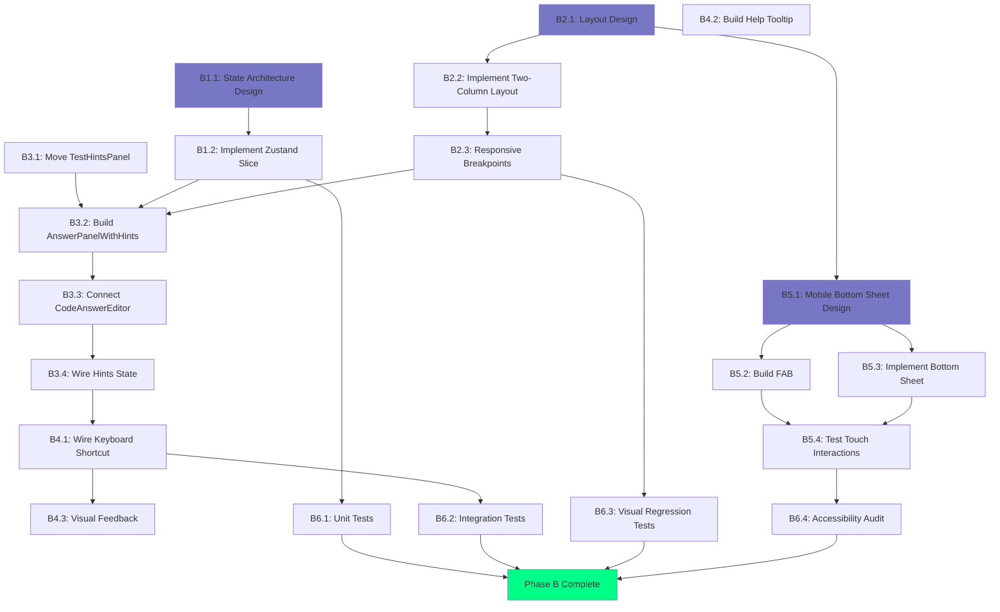

# Phase B: TestHintsPanel Integration - Agent Delegation Plan
**Date**: October 26, 2025
**Sprint Duration**: 2 workdays (16 hours)
**Strategy**: Progressive delivery with parallel execution
**Parent Document**: `frontend-prep-report-phase-b.md`

---

## Executive Summary

This document provides **agent delegation and routing** for Phase B: TestHintsPanel Integration + Keyboard Shortcuts. Each task is assigned to a specialized agent based on their capabilities.

**Phase B Scope**:
- Integrate existing TestHintsPanel component with Answer Panel
- Implement keyboard shortcut (Cmd/Ctrl+/) to toggle hints
- Build responsive layout (side-by-side desktop, stacked mobile)
- Add state management for hints visibility

**Foundation**: Phase A completed (CodeMirror Dark Theme + Answer Panel Components)

**Key Principles**:
- **Parallel execution** where possible (maximize velocity)
- **Right agent for the right task** (leverage specialization)
- **Clear handoffs** (defined deliverables and validation)
- **Quality gates** (testing and review checkpoints)

---

## Agent Capabilities Reference

| Agent | Specialization | When to Use |
|-------|----------------|-------------|
| **frontend-ui-developer** | React/TypeScript, components, hooks, state | Component implementation, integration, hooks |
| **backend-system-architect** | State management design, architecture | Zustand slice design, data flow architecture |
| **code-quality-reviewer** | Testing, linting, performance, accessibility | Unit tests, integration tests, QA validation |
| **ux-researcher** | Usability testing, accessibility, user flows | User testing, WCAG compliance, UX validation |
| **rapid-ui-designer** | UI/UX design, responsive layouts, mockups | Layout design, responsive breakpoints, visual specs |
| **whimsy-injector** | Animations, micro-interactions, polish | Smooth transitions, visual feedback, delight |
| **studio-coach** | Orchestration, integration, handoffs | Phase coordination, conflict resolution |

---

## Phase B Task Breakdown with Agent Delegation

### Task B1: State Management (~2 hours)

**Goal**: Create Zustand slice for Answer Panel state management

| # | Task | Agent | Effort | Dependencies | Deliverable |
|---|------|-------|--------|--------------|-------------|
| B1.1 | Design Zustand state architecture | **backend-system-architect** | 1h | None | State architecture design doc |
| B1.2 | Implement answer-panel-slice.ts | **frontend-ui-developer** | 1h | B1.1 | Working Zustand slice with tests |

**Agent Assignment Rationale**:
- **backend-system-architect**: Best suited for state architecture and data flow design
- **frontend-ui-developer**: Implements the design with TypeScript and Zustand

**Deliverables**:
- `frontend/src/store/slices/answer-panel-slice.ts` - Zustand slice
- State interface with `hintsVisible`, `toggleHints()`, localStorage persistence
- Basic unit tests for state management

**Handoff**: State management → Layout design

---

### Task B2: Layout Updates (~3 hours)

**Goal**: Update AnswerPanelContainer for responsive two-column layout

| # | Task | Agent | Effort | Dependencies | Deliverable |
|---|------|-------|--------|--------------|-------------|
| B2.1 | Design responsive layout specs | **rapid-ui-designer** | 1h | None | Layout mockups (desktop/tablet/mobile) |
| B2.2 | Implement two-column layout (CSS Grid) | **frontend-ui-developer** | 1.5h | B2.1 | Updated AnswerPanelContainer |
| B2.3 | Add responsive breakpoints | **frontend-ui-developer** | 0.5h | B2.2 | Responsive layout working |

**Agent Assignment Rationale**:
- **rapid-ui-designer**: Creates responsive layout specifications and breakpoints
- **frontend-ui-developer**: Implements CSS Grid layout with Tailwind classes

**Deliverables**:
- Updated `AnswerPanelContainer.tsx` with two-column layout
- Desktop: 60/40 split (editor/hints)
- Tablet: Stacked layout
- Mobile: Full-width editor, hints in bottom sheet

**Handoff**: Layout → Component integration

---

### Task B3: Component Integration (~4 hours)

**Goal**: Integrate TestHintsPanel into Answer Panel with hints toggle

| # | Task | Agent | Effort | Dependencies | Deliverable |
|---|------|-------|--------|--------------|-------------|
| B3.1 | Move TestHintsPanel to assessment module | **frontend-ui-developer** | 0.5h | None | TestHintsPanel in correct location |
| B3.2 | Build AnswerPanelWithHints composite | **frontend-ui-developer** | 1.5h | B1.2, B2.3, B3.1 | Composite component |
| B3.3 | Connect CodeAnswerEditor to hints toggle | **frontend-ui-developer** | 1h | B3.2 | Working toggle integration |
| B3.4 | Wire hints state to components | **frontend-ui-developer** | 1h | B3.3 | State synced across components |

**Agent Assignment Rationale**:
- **frontend-ui-developer**: Handles all React component integration, props, and state wiring

**Deliverables**:
- `frontend/src/modules/assessment/components/AnswerPanel/Hints/AnswerPanelWithHints.tsx`
- TestHintsPanel moved to `modules/assessment/components/`
- CodeAnswerEditor `onToggleHints` callback wired to state
- Hints panel visibility controlled by Zustand state

**Handoff**: Component integration → Keyboard shortcuts

---

### Task B4: Keyboard Shortcuts (~2 hours)

**Goal**: Wire keyboard shortcuts to hints toggle with visual feedback

| # | Task | Agent | Effort | Dependencies | Deliverable |
|---|------|-------|--------|--------------|-------------|
| B4.1 | Wire onToggleHints to state management | **frontend-ui-developer** | 0.5h | B3.4 | Keyboard shortcut functional |
| B4.2 | Build KeyboardShortcutsHelp tooltip | **frontend-ui-developer** | 1h | None | Help tooltip component |
| B4.3 | Add visual feedback on shortcut use | **whimsy-injector** | 0.5h | B4.1 | Smooth toggle animation |

**Agent Assignment Rationale**:
- **frontend-ui-developer**: Wires keyboard shortcuts to state and builds tooltip
- **whimsy-injector**: Adds smooth animations and visual feedback

**Deliverables**:
- `frontend/src/modules/assessment/components/AnswerPanel/Hints/KeyboardShortcutsHelp.tsx`
- Cmd/Ctrl+/ toggles hints panel
- Tooltip shows available shortcuts
- Smooth fade-in/out animation on toggle

**Handoff**: Keyboard shortcuts → Mobile experience

---

### Task B5: Mobile Experience (~3 hours)

**Goal**: Optimize hints panel for mobile with bottom sheet and FAB

| # | Task | Agent | Effort | Dependencies | Deliverable |
|---|------|-------|--------|--------------|-------------|
| B5.1 | Design mobile bottom sheet UX | **rapid-ui-designer** | 1h | B2.1 | Mobile UX mockups |
| B5.2 | Build HintsToggleButton FAB | **frontend-ui-developer** | 1h | B5.1 | Floating action button |
| B5.3 | Implement bottom sheet for hints | **frontend-ui-developer** | 0.5h | B5.1, B5.2 | Mobile bottom sheet |
| B5.4 | Test touch interactions | **ux-researcher** | 0.5h | B5.3 | Mobile UX validation |

**Agent Assignment Rationale**:
- **rapid-ui-designer**: Designs mobile-specific UX patterns
- **frontend-ui-developer**: Implements mobile components
- **ux-researcher**: Validates touch interactions and usability

**Deliverables**:
- `frontend/src/modules/assessment/components/AnswerPanel/Hints/HintsToggleButton.tsx`
- Mobile FAB for hints toggle
- Bottom sheet component for hints on mobile
- Touch-optimized interactions

**Handoff**: Mobile experience → Testing

---

### Task B6: Testing & Quality Assurance (~2 hours)

**Goal**: Comprehensive testing and quality validation

| # | Task | Agent | Effort | Dependencies | Deliverable |
|---|------|-------|--------|--------------|-------------|
| B6.1 | Unit tests (state management) | **code-quality-reviewer** | 0.5h | B1.2 | Unit test suite |
| B6.2 | Integration tests (keyboard shortcuts) | **code-quality-reviewer** | 0.5h | B4.1 | Integration test suite |
| B6.3 | Visual regression tests (layouts) | **code-quality-reviewer** | 0.5h | B2.3, B5.3 | Visual regression tests |
| B6.4 | Accessibility audit (WCAG 2.1 AA) | **ux-researcher** | 0.5h | B5.4 | Accessibility report |

**Agent Assignment Rationale**:
- **code-quality-reviewer**: Writes automated tests and performs technical QA
- **ux-researcher**: Conducts accessibility audit and UX validation

**Deliverables**:
- Unit tests for Zustand slice (toggleHints, localStorage)
- Integration tests for keyboard shortcuts
- Visual regression tests for all layouts
- WCAG 2.1 AA compliance report

**Handoff**: Testing → Phase B completion

---

## Phase B Summary

### Total Effort by Agent

| Agent | Total Hours | Percentage | Key Responsibilities |
|-------|-------------|------------|---------------------|
| **frontend-ui-developer** | 9h | 56% | Component implementation, integration, hooks |
| **rapid-ui-designer** | 2h | 13% | Layout design, responsive specs, mobile UX |
| **code-quality-reviewer** | 1.5h | 9% | Testing, QA, performance validation |
| **backend-system-architect** | 1h | 6% | State architecture design |
| **ux-researcher** | 1h | 6% | Mobile UX testing, accessibility audit |
| **whimsy-injector** | 0.5h | 3% | Animation polish, visual feedback |
| **studio-coach** | 1h | 6% | Orchestration, handoffs, integration |
| **Total** | **16h** | **100%** | **~2 workdays** |

### Calendar Time with Parallel Execution

**Without Parallelization**: 16 hours (2 full workdays)
**With Parallelization**: 10-12 hours (1.5 workdays)

**Parallel Streams**:
1. **Stream A** (Days 1-2 morning): B1.1 + B2.1 (design work)
2. **Stream B** (Day 2 afternoon): B1.2 + B2.2 (implementation)
3. **Stream C** (Day 2 evening): B3.1-B3.4 (integration)
4. **Stream D** (Day 3 morning): B4.1-B4.3 + B5.1-B5.4 (features + mobile)
5. **Stream E** (Day 3 afternoon): B6.1-B6.4 (testing)

**Parallelization Factor**: 1.3x (compressed 2 days → 1.5 days)

---

## Dependency Graph



---

## Success Criteria

**Phase B is complete when**:
1. ✅ Cmd/Ctrl+/ toggles hints panel visibility
2. ✅ Desktop layout shows editor and hints side-by-side
3. ✅ Mobile layout shows hints as bottom sheet
4. ✅ Hints visibility preference persists across sessions
5. ✅ All keyboard shortcuts work (submit, save, toggle hints)
6. ✅ Code quality standards met (ESLint, TypeScript, file size)
7. ✅ Accessibility tests pass (keyboard navigation, screen readers)
8. ✅ Visual regression tests pass (desktop, tablet, mobile)

---

## Risk Mitigation by Agent

| Risk | Mitigation Agent | Strategy |
|------|------------------|----------|
| State management complexity | **backend-system-architect** | Design review before implementation |
| Responsive layout issues | **rapid-ui-designer** + **frontend-ui-developer** | Iterative testing on real devices |
| Mobile keyboard covers editor | **frontend-ui-developer** | Viewport height calculation, iOS testing |
| Accessibility gaps | **ux-researcher** | WCAG audit with axe DevTools |
| Performance issues (large hints) | **code-quality-reviewer** | Performance testing with profiler |
| Agent handoffs fail | **studio-coach** | Clear deliverables, validation gates |

---

## Communication & Handoff Protocol

### Between Tasks

1. **Design → Implementation**
   - **Designer** delivers: Mockups, specs, responsive breakpoints
   - **Developer** validates: Technical feasibility, implementation complexity
   - **Handoff format**: Figma link + markdown spec + code examples

2. **Implementation → Testing**
   - **Developer** delivers: Working components, deployed preview
   - **QA** validates: Functionality, performance, accessibility
   - **Handoff format**: PR link + demo video + test instructions

3. **Testing → Refinement**
   - **QA** delivers: Bug reports, accessibility issues
   - **Developer** fixes: Based on priority labels
   - **Handoff format**: GitHub issues with severity labels

### Phase Gates

| Gate | Criteria | Approver |
|------|----------|----------|
| **B1 → B2** | State architecture approved | **backend-system-architect** |
| **B2 → B3** | Layout design approved | **rapid-ui-designer** |
| **B3 → B4** | Component integration working | **frontend-ui-developer** |
| **B4 → B5** | Keyboard shortcuts functional | **code-quality-reviewer** |
| **B5 → B6** | Mobile UX acceptable | **ux-researcher** |
| **B6 → Complete** | All tests pass + WCAG AA | **code-quality-reviewer** + **studio-coach** |

---

## Next Steps

### Immediate (Today)

1. **Create GitHub project board** with all Phase B tasks
2. **Assign agents** to tasks based on delegation matrix
3. **Set up parallel work streams** (design + dev prep)
4. **Review Phase A artifacts** to ensure smooth handoff

### Day 1 (Phase B Start)

**Morning**:
- **backend-system-architect**: Start state architecture design (B1.1)
- **rapid-ui-designer**: Start layout design specs (B2.1)
- **frontend-ui-developer**: Review Phase A code, prepare dev environment

**Afternoon**:
- **frontend-ui-developer**: Implement Zustand slice (B1.2) once design ready
- **rapid-ui-designer**: Continue layout specs, start mobile UX (B5.1)
- **studio-coach**: Monitor progress, facilitate handoffs

### Day 2 (Integration)

**Morning**:
- **frontend-ui-developer**: Implement layout (B2.2, B2.3)
- **frontend-ui-developer**: Move TestHintsPanel (B3.1)

**Afternoon**:
- **frontend-ui-developer**: Build composite component (B3.2, B3.3, B3.4)
- **whimsy-injector**: Add visual feedback (B4.3)

**Evening**:
- **frontend-ui-developer**: Wire keyboard shortcuts (B4.1)
- **frontend-ui-developer**: Build help tooltip (B4.2)

### Day 3 (Mobile + Testing)

**Morning**:
- **frontend-ui-developer**: Build mobile components (B5.2, B5.3)
- **ux-researcher**: Test mobile UX (B5.4)

**Afternoon**:
- **code-quality-reviewer**: Write tests (B6.1, B6.2, B6.3)
- **ux-researcher**: Accessibility audit (B6.4)
- **studio-coach**: Final review and approval

---

## Phase A Dependencies Verification

**Required from Phase A** (✅ All Complete):
- ✅ CodeAnswerEditor component (with onToggleHints prop)
- ✅ AnswerPanelContainer component
- ✅ useCodeMirrorKeymap hook (keyboard shortcuts)
- ✅ Dark theme implementation
- ✅ TestHintsPanel component exists in `modules/practice/components/`

**Status**: All Phase A dependencies verified and ready for Phase B

---

## Architectural Notes

### Module Location Decision

**Current**: TestHintsPanel in `modules/practice/components/`
**Target**: Move to `modules/assessment/components/`

**Rationale** (from Phase A report):
- AnswerPanel already moved to `assessment/` for module cohesion
- QuestionPanel also in `assessment/`
- Follows 6-folder architecture pattern
- Better domain-driven organization

**Task**: B3.1 will handle this migration

### File Structure (Updated)

```
frontend/src/
├── modules/assessment/components/AnswerPanel/
│   ├── AnswerPanelContainer.tsx           ← ✅ EXISTS (Phase A)
│   ├── CodeEditor/
│   │   └── CodeAnswerEditor.tsx           ← ✅ EXISTS (Phase A)
│   ├── Hints/                              ← NEW FOLDER (Phase B)
│   │   ├── AnswerPanelWithHints.tsx       ← NEW (B3.2)
│   │   ├── KeyboardShortcutsHelp.tsx      ← NEW (B4.2)
│   │   ├── HintsToggleButton.tsx          ← NEW (B5.2)
│   │   └── TestHintsPanel.tsx             ← MOVED from practice (B3.1)
│   ├── types.ts                            ← ✅ EXISTS - UPDATE
│   └── index.ts                            ← ✅ EXISTS - UPDATE
├── store/slices/
│   └── answer-panel-slice.ts               ← NEW (B1.2)
```

---

## Conclusion

**Ready to Start**: ✅ YES

Phase B has clear scope, well-defined tasks, and proper agent delegation. All dependencies from Phase A are complete. The implementation can begin immediately.

**Estimated Timeline**: 16 hours (2 workdays solo, 1.5 workdays with parallelization)

**Risk Level**: Low (stable foundation, clear requirements, proven patterns)

**Next Action**: Begin Phase B with state architecture design (B1.1) and layout design (B2.1) in parallel

---

**Document Version**: 1.0
**Last Updated**: October 26, 2025
**Status**: Ready for Phase B Kickoff
**Total Sprint Duration**: 1.5-2 workdays (with parallel execution)
