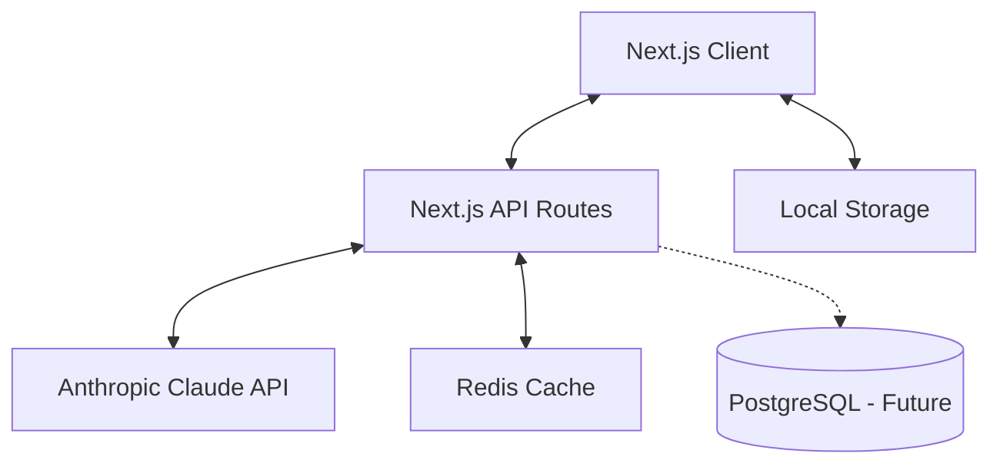

# Technical Architecture Document
## DevPrep AI - System Design & Implementation Guide

### Version 1.0.0 | September 2025

---

## 1. System Overview

### 1.1 Architecture Principles
1. **Modularity**: Components < 180 lines, functions < 50 lines
2. **Type Safety**: TypeScript strict mode throughout
3. **Performance**: Optimistic UI, edge caching, lazy loading
4. **Simplicity**: Minimal dependencies, clear separation of concerns
5. **Maintainability**: Low complexity (max 15), comprehensive testing

### 1.2 High-Level Architecture



---

## 2. Technology Stack

### 2.1 Core Technologies

| Layer | Technology | Version | Justification |
|-------|------------|---------|---------------|
| Framework | Next.js | 15.0.0 | App Router, RSC, built-in optimizations |
| Language | TypeScript | 5.6.0 | Type safety, better DX, refactoring support |
| Styling | Tailwind CSS | 3.4.0 | Utility-first, consistent design system |
| UI Components | shadcn/ui | Latest | Accessible, customizable, radix-ui based |
| AI Integration | Anthropic SDK | 0.30.0 | Official SDK, TypeScript support |
| State Management | Zustand | 5.0.0 | Simple, TypeScript-friendly, small bundle |
| Forms | React Hook Form | 7.54.0 | Performance, validation, TypeScript |
| Animations | Framer Motion | 11.0.0 | Declarative animations, gestures |
| Database ORM | Prisma | 6.0.0 | Type-safe, migrations (future) |
| Cache | Redis/Upstash | Latest | Response caching, rate limiting |

### 2.2 Development Tools

| Tool | Purpose | Configuration |
|------|---------|--------------|
| ESLint | Code quality | Custom rules for complexity/lines |
| Prettier | Code formatting | 2 spaces, single quotes |
| Husky | Git hooks | Pre-commit linting |
| Vitest | Unit testing | Component & utility tests |
| Playwright | E2E testing | Critical user flows |
| Bundle Analyzer | Performance | Webpack bundle analysis |

---

## 3. Project Structure

### 3.1 Directory Organization

```
devprep-ai/
├── src/
│   ├── app/                    # Next.js app router
│   │   ├── (auth)/             # Future: auth routes
│   │   ├── api/                # API endpoints
│   │   │   ├── ai/            # Claude integration
│   │   │   ├── questions/     # Question management
│   │   │   └── assessment/    # Assessment logic
│   │   ├── assessment/        # Assessment pages
│   │   ├── learn/             # Learning mode pages
│   │   ├── profile/           # User profiling
│   │   ├── globals.css        # Global styles
│   │   ├── layout.tsx         # Root layout
│   │   └── page.tsx           # Home page
│   │
│   ├── components/
│   │   ├── ui/                # shadcn/ui components
│   │   │   ├── button.tsx     # < 50 lines each
│   │   │   ├── card.tsx
│   │   │   ├── dialog.tsx
│   │   │   └── ...
│   │   ├── forms/             # Form components
│   │   │   ├── ProfileForm.tsx
│   │   │   ├── AssessmentSetup.tsx
│   │   │   └── QuestionInput.tsx
│   │   ├── layouts/           # Layout components
│   │   │   ├── Header.tsx
│   │   │   ├── Footer.tsx
│   │   │   └── Container.tsx
│   │   └── features/          # Feature components
│   │       ├── QuestionCard.tsx
│   │       ├── ProgressChart.tsx
│   │       └── Timer.tsx
│   │
│   ├── hooks/                  # Custom React hooks
│   │   ├── useAnthropicChat.ts
│   │   ├── useLocalStorage.ts
│   │   ├── useQuestions.ts
│   │   ├── useAssessment.ts
│   │   └── useProgress.ts
│   │
│   ├── services/              # Business logic
│   │   ├── anthropic/
│   │   │   ├── client.ts     # API client setup
│   │   │   ├── prompts/      # Prompt templates
│   │   │   │   ├── profile.ts
│   │   │   │   ├── questions.ts
│   │   │   │   └── feedback.ts
│   │   │   ├── parser.ts     # Response parsing
│   │   │   └── types.ts      # Claude types
│   │   ├── questions/
│   │   │   ├── generator.ts
│   │   │   ├── categories.ts
│   │   │   └── difficulty.ts
│   │   └── assessment/
│   │       ├── evaluator.ts
│   │       ├── scoring.ts
│   │       └── feedback.ts
│   │
│   ├── lib/                   # Utilities
│   │   ├── constants/
│   │   │   ├── questions.ts
│   │   │   ├── levels.ts
│   │   │   └── technologies.ts
│   │   ├── utils/
│   │   │   ├── format.ts
│   │   │   ├── validation.ts
│   │   │   └── storage.ts
│   │   └── config/
│   │       ├── site.ts
│   │       └── api.ts
│   │
│   ├── stores/               # State management
│   │   ├── userStore.ts
│   │   ├── questionStore.ts
│   │   └── assessmentStore.ts
│   │
│   └── types/                # TypeScript types
│       ├── user.ts
│       ├── question.ts
│       ├── assessment.ts
│       └── api.ts
│
├── public/                   # Static assets
├── tests/                    # Test files
│   ├── unit/
│   ├── integration/
│   └── e2e/
├── Docs/                     # Documentation
├── .eslintrc.json           # ESLint config
├── tsconfig.json            # TypeScript config
├── next.config.mjs          # Next.js config
├── tailwind.config.ts       # Tailwind config
├── package.json
└── README.md
```

### 3.2 Module Boundaries

Each module must:
- Be under 180 lines of code
- Have a single responsibility
- Export a clear public API
- Contain its own types
- Include unit tests

---

## 4. Core Systems Design

### 4.1 Anthropic Integration Layer

#### Client Setup (`services/anthropic/client.ts`)
```typescript
// Max 180 lines
import Anthropic from '@anthropic-ai/sdk';

export class AnthropicClient {
  private client: Anthropic;
  private defaultModel = 'claude-3-5-sonnet-20241022';

  constructor(apiKey: string) {
    this.client = new Anthropic({ apiKey });
  }

  async generateQuestion(params: QuestionParams): Promise<Question> {
    // Implementation
  }

  async evaluateAnswer(params: EvalParams): Promise<Feedback> {
    // Implementation
  }
}
```

#### Prompt Management (`services/anthropic/prompts/`)
Each file < 180 lines:
- `profile.ts`: User profiling prompts
- `questions.ts`: Question generation templates
- `feedback.ts`: Assessment evaluation prompts

#### Response Parser (`services/anthropic/parser.ts`)
```typescript
// Max 180 lines
export class ResponseParser {
  parseQuestion(response: string): Question { }
  parseFeedback(response: string): Feedback { }
  extractCode(response: string): CodeBlock[] { }
}
```

### 4.2 State Management Architecture

#### User Store (`stores/userStore.ts`)
```typescript
// Max 180 lines
interface UserState {
  profile: UserProfile | null;
  preferences: UserPreferences;
  setProfile: (profile: UserProfile) => void;
  updatePreferences: (prefs: Partial<UserPreferences>) => void;
}
```

#### Question Store (`stores/questionStore.ts`)
```typescript
// Max 180 lines
interface QuestionState {
  questions: Question[];
  currentQuestion: Question | null;
  loading: boolean;
  fetchQuestions: (params: FetchParams) => Promise<void>;
  setCurrentQuestion: (id: string) => void;
}
```

### 4.3 API Route Structure

#### AI Endpoint (`app/api/ai/route.ts`)
```typescript
// Max 180 lines
export async function POST(request: Request) {
  // Rate limiting
  // Request validation
  // Claude API call
  // Response caching
  // Error handling
}
```

#### Questions Endpoint (`app/api/questions/route.ts`)
```typescript
// Max 180 lines
export async function GET(request: Request) {
  // Query parsing
  // Cache check
  // Question generation
  // Response formatting
}
```

---

## 5. Data Models

### 5.1 Core Entities

#### User Profile
```typescript
interface UserProfile {
  id: string;
  seniorityLevel: 'junior' | 'mid' | 'senior' | 'staff' | 'lead';
  technologies: Technology[];
  yearsExperience: number;
  interviewType: InterviewType[];
  createdAt: Date;
  updatedAt: Date;
}
```

#### Question
```typescript
interface Question {
  id: string;
  category: QuestionCategory;
  difficulty: 1 | 2 | 3 | 4 | 5;
  type: 'conceptual' | 'coding' | 'debug' | 'design';
  title: string;
  content: string;
  hints?: string[];
  solution?: Solution;
  metadata: QuestionMetadata;
}
```

#### Assessment
```typescript
interface Assessment {
  id: string;
  userId: string;
  questions: Question[];
  answers: Answer[];
  startedAt: Date;
  completedAt?: Date;
  feedback?: Feedback[];
  score?: Score;
}
```

### 5.2 API Contracts

#### Question Generation Request
```typescript
interface GenerateQuestionRequest {
  profile: UserProfile;
  category?: QuestionCategory;
  difficulty?: number;
  count?: number;
}
```

#### Evaluation Request
```typescript
interface EvaluateAnswerRequest {
  questionId: string;
  answer: string;
  timeSpent: number;
  hints Used: number;
}
```

---

## 6. Performance Optimization

### 6.1 Frontend Optimizations

| Technique | Implementation | Impact |
|-----------|---------------|--------|
| Code Splitting | Dynamic imports for routes | -40% initial bundle |
| Lazy Loading | React.lazy for components | -25% TTI |
| Image Optimization | Next/Image with blur placeholders | -50% LCP |
| Font Optimization | Next/Font with preload | -100ms FCP |
| Bundle Analysis | Regular audits, tree shaking | -30% JS size |

### 6.2 API Optimizations

| Technique | Implementation | Impact |
|-----------|---------------|--------|
| Response Caching | Redis with 5min TTL | -70% Claude API calls |
| Request Batching | Queue similar requests | -50% API requests |
| Edge Caching | Vercel Edge Network | -60% latency |
| Streaming Responses | Server-Sent Events | Better UX |
| Rate Limiting | Token bucket algorithm | Cost control |

### 6.3 Claude API Optimization

```typescript
// Token usage optimization strategies
const optimizationStrategies = {
  promptCompression: true,      // Remove redundant text
  responseLimit: 500,           // Token limit per response
  caching: true,                // Cache similar requests
  batching: true,               // Batch similar prompts
  streaming: true,              // Stream long responses
};
```

---

## 7. Security Considerations

### 7.1 API Security

| Measure | Implementation | Purpose |
|---------|---------------|---------|
| API Key Management | Environment variables | Prevent exposure |
| Rate Limiting | Per-IP limits | Prevent abuse |
| Input Validation | Zod schemas | Prevent injection |
| CORS | Strict origin policy | Prevent XSS |
| CSP Headers | Strict policy | Prevent attacks |

### 7.2 Data Protection

- No PII stored in MVP (localStorage only)
- Sanitize all user inputs
- Escape HTML in responses
- Use HTTPS everywhere
- Regular security audits

---

## 8. Testing Strategy

### 8.1 Testing Pyramid

```
         E2E (10%)
        /    \
    Integration (30%)
    /          \
Unit Tests (60%)
```

### 8.2 Test Coverage Requirements

| Component Type | Min Coverage | Priority |
|---------------|--------------|----------|
| Services | 90% | Critical |
| Hooks | 85% | High |
| Utils | 95% | High |
| Components | 70% | Medium |
| API Routes | 80% | High |

### 8.3 Testing Tools Configuration

```javascript
// vitest.config.ts
export default {
  test: {
    coverage: {
      reporter: ['text', 'html'],
      threshold: {
        branches: 80,
        functions: 80,
        lines: 85,
        statements: 85
      }
    }
  }
}
```

---

## 9. Monitoring & Observability

### 9.1 Application Monitoring

| Metric | Tool | Threshold |
|--------|------|-----------|
| Performance | Vercel Analytics | Core Web Vitals |
| Errors | Sentry | < 0.1% error rate |
| API Usage | Custom Dashboard | Token limits |
| User Analytics | PostHog | Engagement metrics |

### 9.2 Logging Strategy

```typescript
// Structured logging
const logger = {
  info: (message: string, metadata?: any) => {},
  warn: (message: string, metadata?: any) => {},
  error: (message: string, error?: Error) => {},
  metric: (name: string, value: number) => {}
};
```

---

## 10. DevOps & Deployment

### 10.1 CI/CD Pipeline

```yaml
# GitHub Actions workflow
name: CI/CD
on: [push, pull_request]
jobs:
  lint:
    - ESLint check
    - TypeScript check
    - Prettier check
  test:
    - Unit tests
    - Integration tests
  build:
    - Next.js build
    - Bundle size check
  deploy:
    - Preview deployment
    - Production deployment
```

### 10.2 Environment Configuration

| Environment | Purpose | Configuration |
|-------------|---------|--------------|
| Development | Local dev | .env.local |
| Preview | PR preview | Vercel preview |
| Staging | Pre-prod testing | staging.domain |
| Production | Live app | app.domain |

---

## 11. Scalability Considerations

### 11.1 Horizontal Scaling

- Stateless API design
- Redis for shared state
- Load balancer ready
- Database connection pooling

### 11.2 Performance Targets

| Metric | MVP Target | Future Target |
|--------|------------|---------------|
| Concurrent Users | 100 | 10,000 |
| API RPS | 50 | 1,000 |
| Response Time (p95) | < 1s | < 500ms |
| Uptime | 99.5% | 99.9% |

---

## 12. Migration Strategy

### 12.1 From MVP to Production

1. **Phase 1**: Add authentication system
2. **Phase 2**: Migrate localStorage to PostgreSQL
3. **Phase 3**: Implement user sessions
4. **Phase 4**: Add payment processing
5. **Phase 5**: Scale infrastructure

### 12.2 Database Migration Plan

```sql
-- Initial schema
CREATE TABLE users (
  id UUID PRIMARY KEY,
  email VARCHAR(255) UNIQUE,
  profile JSONB,
  created_at TIMESTAMP
);

CREATE TABLE assessments (
  id UUID PRIMARY KEY,
  user_id UUID REFERENCES users(id),
  data JSONB,
  created_at TIMESTAMP
);
```

---

## 13. Technical Debt Management

### 13.1 Code Quality Metrics

- Complexity score < 15 per function
- File length < 180 lines
- Test coverage > 80%
- Bundle size < 200KB (gzipped)
- Lighthouse score > 90

### 13.2 Refactoring Priority

1. Extract reusable hooks
2. Optimize bundle size
3. Improve test coverage
4. Reduce API latency
5. Enhance error handling

---

## 14. Documentation Requirements

### 14.1 Code Documentation

```typescript
/**
 * Generates interview questions based on user profile
 * @param profile - User profile with experience level
 * @param options - Generation options
 * @returns Array of generated questions
 * @throws AnthropicAPIError if API fails
 */
```

### 14.2 API Documentation

- OpenAPI 3.0 specification
- Postman collection
- Integration examples
- Error code reference

---

## 15. Appendix

### 15.1 Technology Decision Records

| Decision | Choice | Rationale |
|----------|--------|-----------|
| Framework | Next.js 15 | App Router, RSC, performance |
| AI Provider | Anthropic | Superior context, better responses |
| State Management | Zustand | Simple, TypeScript support |
| Component Library | shadcn/ui | Customizable, accessible |

### 15.2 References

- [Next.js Documentation](https://nextjs.org/docs)
- [Anthropic API Reference](https://docs.anthropic.com)
- [TypeScript Handbook](https://www.typescriptlang.org/docs)
- [React 19 Patterns](https://react.dev)

---

*Last Updated: September 17, 2025*
*Version: 1.0.0*
*Status: Implementation Ready*