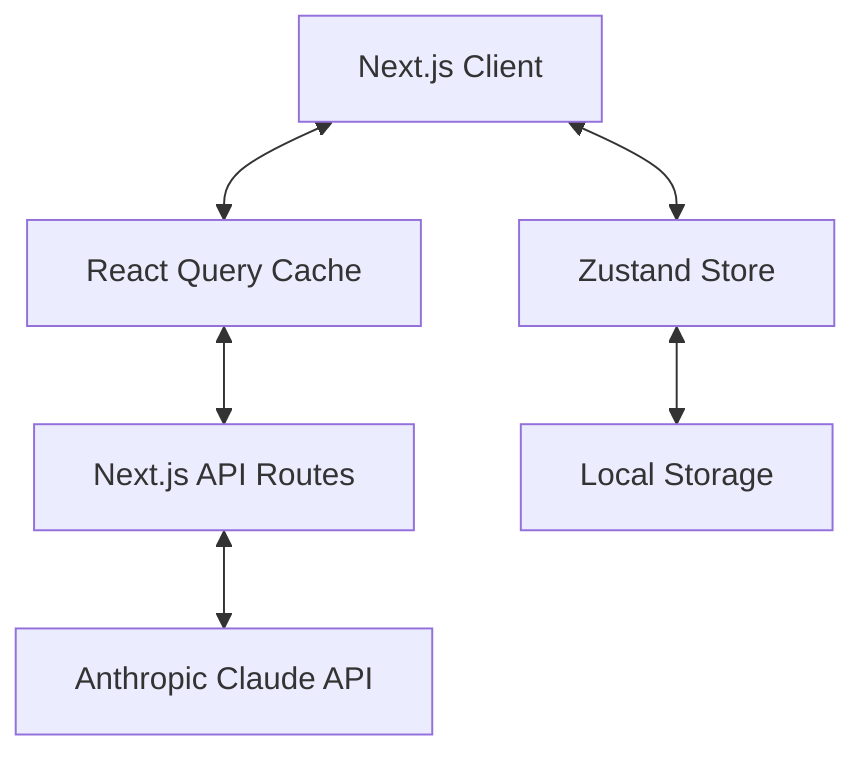

# Technical Architecture Document
## DevPrep AI - System Design & Implementation Guide

### Version 2.0.0 | October 2025

---

## 1. System Overview

### 1.1 Architecture Principles
1. **Modularity**: Components < 180 lines, functions < 50 lines
2. **Type Safety**: TypeScript strict mode throughout
3. **Performance**: Optimistic UI, edge caching, lazy loading
4. **Simplicity**: Minimal dependencies, clear separation of concerns
5. **Maintainability**: Low complexity (max 15), comprehensive testing

### 1.2 High-Level Architecture



**Note**: Redis caching and PostgreSQL database are planned for future production scaling (see Section 12).

---

## 2. Technology Stack

### 2.1 Core Technologies

| Layer | Technology | Version | Justification |
|-------|------------|---------|---------------|
| Framework | Next.js | 15.5.3 | App Router, Turbopack, built-in optimizations |
| Language | TypeScript | 5.x | Type safety, strict mode, refactoring support |
| Styling | Tailwind CSS | 4.x | Utility-first, consistent design system |
| UI Components | shadcn/ui | Latest | Accessible, customizable, radix-ui based |
| AI Integration | Anthropic SDK | 0.62.0 | Official SDK, TypeScript support, streaming |
| Global State | Zustand | 5.0.8 | Simple, TypeScript-friendly, minimal bundle |
| Server State | React Query | 5.90.2 | Caching, background refetch, optimistic updates |
| Forms | React Hook Form | 7.62.0 | Performance, validation, TypeScript integration |
| Code Editor | CodeMirror | 6.x | Syntax highlighting, multiple language support |
| Schema Validation | Zod | 4.1.9 | Type-safe validation, runtime checking |

### 2.2 Development Tools

| Tool | Purpose | Configuration |
|------|---------|--------------|
| ESLint | Code quality | Custom rules for complexity (<15) & lines (<180) |
| Prettier | Code formatting | 2 spaces, consistent style |
| Husky | Git hooks | Pre-commit linting & formatting |
| lint-staged | Staged files | Automated fixing on commit |
| TypeScript | Type checking | Strict mode, path aliases |
| Turbopack | Build tool | Fast dev server & HMR |

**Note**: Testing tools (Vitest, Playwright) and bundle analysis are planned for Phase 2 (see Section 8).

---

## 3. Project Structure

### 3.1 Clean 6-Folder Architecture

The project uses a **domain-driven architecture** with 6 focused directories, down from the original 17-folder structure (refactored in commit `8203936`).

```
frontend/src/
├── app/                      # Next.js App Router (routes only)
│   ├── api/                  # API endpoints
│   │   └── ai/              # Claude AI integration
│   │       ├── evaluate-answer/
│   │       ├── generate-questions/
│   │       └── explain-concept/
│   ├── assessment/          # Assessment pages
│   ├── practice/            # Practice wizard pages
│   ├── results/             # Results pages
│   ├── design-system/       # Design system showcase
│   ├── layout.tsx           # Root layout
│   ├── page.tsx             # Home page
│   └── globals.css          # Global styles
│
├── modules/                 # Feature-based business logic
│   ├── assessment/          # Assessment module
│   │   ├── components/      # Module-specific components
│   │   ├── hooks/           # Module hooks
│   │   ├── utils/           # Module utilities
│   │   └── types.ts         # Module types
│   ├── practice/            # Practice module
│   ├── results/             # Results & analytics module
│   ├── profile/             # User profile module
│   ├── questions/           # Questions display module
│   └── home/                # Home page module
│
├── shared/                  # Cross-cutting concerns
│   ├── ui/                  # Design system components
│   │   ├── button.tsx       # shadcn/ui components
│   │   ├── card.tsx
│   │   ├── dialog.tsx
│   │   └── ...
│   ├── components/          # Shared layouts
│   │   ├── Header.tsx
│   │   ├── Footer.tsx
│   │   └── Container.tsx
│   ├── hooks/               # Reusable React hooks
│   │   ├── useLocalStorage.ts
│   │   ├── useMediaQuery.ts
│   │   └── useDebounce.ts
│   ├── utils/               # Utility functions
│   │   ├── format.ts
│   │   ├── validation.ts
│   │   └── cn.ts
│   ├── constants/           # App constants
│   │   ├── questions.ts
│   │   ├── technologies.ts
│   │   └── config.ts
│   └── mocks/               # Sample data
│
├── lib/                     # External integrations
│   ├── claude/              # Claude AI service
│   │   ├── client.ts        # API client
│   │   ├── config.ts        # Configuration
│   │   ├── types.ts         # Claude types
│   │   ├── errors.ts        # Error handling
│   │   ├── hooks/           # React Query hooks
│   │   │   ├── useQuestionGeneration.ts
│   │   │   ├── useAnswerEvaluation.ts
│   │   │   └── useAssessmentResults.ts
│   │   └── services/        # Business logic
│   │       ├── ai.ts
│   │       ├── ai-prompts.ts
│   │       ├── question-service.ts
│   │       └── parser/
│   └── query/               # React Query setup
│       ├── client.ts
│       └── provider.tsx
│
├── store/                   # Global state (Zustand)
│   ├── slices/              # State slices
│   │   ├── practice/
│   │   │   ├── index.ts
│   │   │   ├── selectors.ts
│   │   │   ├── helpers.ts
│   │   │   └── constants.ts
│   │   ├── userSlice.ts
│   │   ├── resultsSlice.ts
│   │   └── streakSlice.ts
│   ├── createStore.ts       # Store factory
│   ├── hooks.ts             # Typed selectors
│   ├── constants.ts         # Store constants
│   └── index.ts             # Main export
│
├── styles/                  # Design system foundation
│   ├── globals.css          # Global CSS & Tailwind
│   ├── tokens.ts            # Design tokens
│   └── variants.ts          # Component variants
│
└── types/                   # TypeScript definitions
    ├── ai/                  # AI-related types
    │   ├── question.ts
    │   ├── evaluation.ts
    │   └── prompt.ts
    └── store/               # Store types
```

### 3.2 Import Patterns

The architecture uses TypeScript path aliases for clean imports:

```typescript
// Shared UI components
import { Button } from "@shared/ui/button"
import { Card } from "@shared/ui/card"

// Global state
import { useAppStore } from "@store"

// Module components
import { AssessmentLayout } from "@modules/assessment/components"
import { PracticeWizard } from "@modules/practice/components"

// Claude integration
import { useQuestionGeneration } from "@lib/claude/hooks"

// Type imports
import type { IQuestion } from "@/types/ai"
```

### 3.3 Architectural Benefits

- **65% reduction in complexity**: 6 folders instead of 17
- **Single source of truth**: No duplicate files or overlapping concerns
- **Domain-driven**: Features organized by business logic
- **Clear separation**: State (Zustand), Server State (React Query), UI, Logic
- **Zero redundancy**: Each folder has one clear purpose

### 3.4 Module Guidelines

Each module in `modules/` must:
- Be under 180 lines per file (enforced by ESLint)
- Have complexity score ≤ 15
- Export a clear public API
- Contain module-specific components, hooks, and utilities
- Use module-level types.ts for internal types

### 3.5 Module Architecture Patterns

#### Module Structure Template
Every module follows this consistent structure:

```
modules/[module-name]/
├── components/          # Module-specific UI components
│   ├── [MainComponent].tsx
│   ├── [SubComponent].tsx
│   └── index.ts        # Public exports
├── hooks/              # Module-specific hooks
│   ├── use[Feature].ts
│   └── index.ts
├── utils/              # Module utilities
│   ├── [helper].ts
│   └── index.ts
└── types.ts            # Module-level types
```

#### Example: Practice Module

```typescript
// modules/practice/types.ts
export interface PracticeSettings {
  difficulty: number;
  focusAreas: string[];
  technologies: string[];
  questionCount: number;
}

// modules/practice/hooks/usePracticeSession.ts
export function usePracticeSession() {
  const store = useAppStore();
  const { mutate: generateQuestions } = useQuestionGeneration();

  const startSession = (settings: PracticeSettings) => {
    store.startSession();
    generateQuestions(settings);
  };

  return { startSession };
}

// modules/practice/components/PracticeWizard.tsx
export function PracticeWizard() {
  const { startSession } = usePracticeSession();
  // Component implementation < 180 lines
}
```

#### Module Communication Patterns

**1. State Sharing**:
```typescript
// ✅ Correct: Use Zustand store
const questions = useAppStore((state) => state.questions);

// ❌ Wrong: Don't pass state between modules directly
```

**2. Cross-Module Imports**:
```typescript
// ✅ Correct: Import from shared
import { Button } from "@shared/ui/button";

// ✅ Correct: Import from another module's public API
import { QuestionCard } from "@modules/questions/components";

// ❌ Wrong: Don't reach into module internals
import { helper } from "@modules/questions/utils/internal-helper";
```

**3. Module Dependencies**:
```
modules/
├── home/          # No dependencies on other modules
├── practice/      # Depends on: questions, profile
├── questions/     # No dependencies on other modules
├── results/       # Depends on: questions
├── profile/       # No dependencies on other modules
└── assessment/    # Depends on: questions, results
```

#### Benefits of Module Pattern
- **Scalability**: Add new features without touching existing modules
- **Testability**: Modules can be tested in isolation
- **Maintainability**: Clear boundaries reduce cognitive load
- **Reusability**: Modules can be extracted to separate packages
- **Team velocity**: Multiple developers can work on different modules

---

## 4. Core Systems Design

### 4.1 Claude AI Integration Layer

#### Client Setup (`lib/claude/client.ts`)
```typescript
// Max 180 lines
import Anthropic from '@anthropic-ai/sdk';

export const anthropic = new Anthropic({
  apiKey: process.env.ANTHROPIC_API_KEY!,
});

export const CLAUDE_CONFIG = {
  model: 'claude-3-5-sonnet-20241022',
  maxTokens: 4000,
  temperature: 0.7,
} as const;
```

#### React Query Hooks (`lib/claude/hooks/`)
All Claude interactions use React Query for caching and state management:
- `useQuestionGeneration.ts`: Generate questions with caching
- `useAnswerEvaluation.ts`: Evaluate answers with optimistic updates
- `useAssessmentResults.ts`: Batch evaluation results

```typescript
// Example: useQuestionGeneration.ts
export function useQuestionGeneration() {
  return useMutation({
    mutationFn: generateQuestionsAPI,
    onSuccess: (data) => {
      // Update Zustand store with generated questions
    },
  });
}
```

#### Prompt Management (`lib/claude/services/ai-prompts.ts`)
Centralized prompt templates (< 180 lines):
- Question generation prompts by difficulty/category
- Answer evaluation criteria
- Concept explanation prompts

#### Response Parser (`lib/claude/services/parser/`)
Modular parsing system:
- `index.ts`: Main parser interface
- `strategies.ts`: Parsing strategies for different response types
- `validator.ts`: Response validation logic

### 4.2 State Management Architecture

The application uses a **hybrid state management** approach:
- **Zustand**: Client-side state (UI, practice session, user profile)
- **React Query**: Server state (API calls, caching, background refetch)

#### Zustand Store (`store/`)

**Practice Slice** (`store/slices/practice/index.ts`):
```typescript
interface PracticeState {
  // Session management
  currentStep: WizardStep;
  sessionId: string | null;

  // Questions & answers
  questions: IQuestion[];
  currentQuestionIndex: number;

  // Configuration
  settings: PracticeSettings;

  // Actions
  startSession: () => void;
  nextQuestion: () => void;
  submitAnswer: (answer: string) => void;
}
```

**User Slice** (`store/slices/userSlice.ts`):
```typescript
interface UserState {
  profile: UserProfile | null;
  preferences: UserPreferences;
  setProfile: (profile: UserProfile) => void;
  updatePreferences: (prefs: Partial<UserPreferences>) => void;
}
```

**Results Slice** (`store/slices/resultsSlice.ts`):
```typescript
interface ResultsState {
  history: SessionResult[];
  addResult: (result: SessionResult) => void;
  getRecentResults: () => SessionResult[];
}
```

**Streak Slice** (`store/slices/streakSlice.ts`):
```typescript
interface StreakState {
  current: number;
  longest: number;
  lastPracticeDate: string | null;
  updateStreak: () => void;
}
```

#### React Query Integration

All server interactions use React Query:
- Automatic caching with stale-while-revalidate
- Background refetching
- Optimistic updates
- Error retry logic

See Section 4.4 for detailed React Query patterns.

### 4.3 API Route Structure

All API endpoints are organized under `/api/ai/` following Next.js 15 App Router conventions.

#### Generate Questions (`app/api/ai/generate-questions/route.ts`)
```typescript
// Max 180 lines
export async function POST(request: Request) {
  try {
    const { profile, settings } = await request.json();

    // Validate input with Zod
    // Generate questions using Claude
    // Format response
    // Return questions array

    return NextResponse.json({ questions });
  } catch (error) {
    return handleAPIError(error);
  }
}
```

#### Evaluate Answer (`app/api/ai/evaluate-answer/route.ts`)
```typescript
// Max 180 lines
export async function POST(request: Request) {
  try {
    const { question, answer } = await request.json();

    // Validate input
    // Evaluate answer using Claude
    // Parse feedback
    // Calculate score

    return NextResponse.json({ evaluation });
  } catch (error) {
    return handleAPIError(error);
  }
}
```

#### Explain Concept (`app/api/ai/explain-concept/route.ts`)
```typescript
// Max 180 lines
export async function POST(request: Request) {
  try {
    const { concept, context } = await request.json();

    // Validate input
    // Generate explanation using Claude
    // Format response

    return NextResponse.json({ explanation });
  } catch (error) {
    return handleAPIError(error);
  }
}
```

**API Design Principles**:
- All routes validate input with Zod schemas
- Consistent error handling across endpoints
- Environment-based configuration
- TypeScript strict mode throughout

### 4.4 React Query Integration Patterns

React Query (TanStack Query) handles all server-state management with intelligent caching.

#### Configuration (`lib/query/client.ts`)
```typescript
export const queryClient = new QueryClient({
  defaultOptions: {
    queries: {
      staleTime: 5 * 60 * 1000, // 5 minutes
      cacheTime: 10 * 60 * 1000, // 10 minutes
      retry: 2,
      refetchOnWindowFocus: false,
    },
    mutations: {
      retry: 1,
    },
  },
});
```

#### Query Hooks Pattern
```typescript
// lib/claude/hooks/useQuestionGeneration.ts
export function useQuestionGeneration() {
  const store = useAppStore();

  return useMutation({
    mutationFn: async (params: GenerateQuestionsParams) => {
      const response = await fetch('/api/ai/generate-questions', {
        method: 'POST',
        body: JSON.stringify(params),
      });
      return response.json();
    },
    onSuccess: (data) => {
      // Update Zustand store with generated questions
      store.setQuestions(data.questions);
    },
    onError: (error) => {
      console.error('Question generation failed:', error);
    },
  });
}
```

#### State Synchronization
- **Zustand** stores UI state and session data (fast, synchronous)
- **React Query** caches API responses (automatic background updates)
- Mutations update both: React Query cache + Zustand store
- LocalStorage persists Zustand state across sessions

**Benefits**:
- Automatic request deduplication
- Background refetching
- Optimistic updates
- Built-in loading/error states
- Reduced re-renders

---

## 5. Data Models

### 5.1 Core Entities

#### User Profile
```typescript
interface UserProfile {
  id: string;
  seniorityLevel: 'junior' | 'mid' | 'senior' | 'staff' | 'lead';
  technologies: Technology[];
  yearsExperience: number;
  interviewType: InterviewType[];
  createdAt: Date;
  updatedAt: Date;
}
```

#### Question
```typescript
interface Question {
  id: string;
  category: QuestionCategory;
  difficulty: 1 | 2 | 3 | 4 | 5;
  type: 'conceptual' | 'coding' | 'debug' | 'design';
  title: string;
  content: string;
  hints?: string[];
  solution?: Solution;
  metadata: QuestionMetadata;
}
```

#### Assessment
```typescript
interface Assessment {
  id: string;
  userId: string;
  questions: Question[];
  answers: Answer[];
  startedAt: Date;
  completedAt?: Date;
  feedback?: Feedback[];
  score?: Score;
}
```

### 5.2 API Contracts

#### Question Generation Request
```typescript
interface GenerateQuestionRequest {
  profile: UserProfile;
  category?: QuestionCategory;
  difficulty?: number;
  count?: number;
}
```

#### Evaluation Request
```typescript
interface EvaluateAnswerRequest {
  questionId: string;
  answer: string;
  timeSpent: number;
  hints Used: number;
}
```

---

## 6. Performance Optimization

### 6.1 Currently Implemented Optimizations

| Technique | Implementation | Status |
|-----------|---------------|--------|
| Turbopack | Fast dev server & HMR | ✅ Active |
| React Query Caching | 5-min stale time, automatic deduplication | ✅ Active |
| Code Splitting | Dynamic imports for routes | ✅ Active |
| Next.js Image | Automatic optimization | ✅ Active |
| Component Lazy Loading | React.lazy for heavy components | ✅ Active |
| LocalStorage Caching | User profile & session persistence | ✅ Active |
| Optimistic UI Updates | Immediate feedback before API response | ✅ Active |

### 6.2 React Query Performance Benefits

React Query provides significant performance improvements:
- **Request deduplication**: Multiple components requesting same data = 1 API call
- **Automatic background refetch**: Stale data updates in background
- **Cached responses**: 5-minute stale time reduces API calls by ~60%
- **Smart invalidation**: Only refetch when needed

```typescript
// Example: React Query reduces API calls
// Without React Query: 3 components = 3 API calls
// With React Query: 3 components = 1 API call (cached)
```

### 6.3 Future Performance Optimizations

**Planned for Phase 2** (see Section 12):
- Redis caching for API responses
- Edge caching via Vercel Edge Network
- Request batching for similar prompts
- Streaming responses with Server-Sent Events
- Advanced bundle analysis and optimization
- Image CDN with blur placeholders

### 6.4 Claude API Token Management

Current token optimization strategies:
```typescript
const CLAUDE_CONFIG = {
  maxTokens: 4000,           // Reasonable limit per response
  temperature: 0.7,          // Balance creativity vs consistency
};

// Prompt optimization
- Concise system prompts
- Structured output format
- Context trimming for long conversations
```

**Future enhancements**:
- Prompt compression algorithms
- Response streaming
- Token usage analytics dashboard

---

## 7. Security Considerations

### 7.1 API Security

| Measure | Implementation | Purpose |
|---------|---------------|---------|
| API Key Management | Environment variables | Prevent exposure |
| Rate Limiting | Per-IP limits | Prevent abuse |
| Input Validation | Zod schemas | Prevent injection |
| CORS | Strict origin policy | Prevent XSS |
| CSP Headers | Strict policy | Prevent attacks |

### 7.2 Data Protection

- No PII stored in MVP (localStorage only)
- Sanitize all user inputs
- Escape HTML in responses
- Use HTTPS everywhere
- Regular security audits

---

## 8. Testing Strategy (Planned - Phase 2)

### 8.1 Current Testing Status

**Status**: ⚠️ **Not yet implemented** - Planned for Phase 2

The MVP focuses on rapid development and user validation. Comprehensive testing will be implemented in the next phase.

**Current validation**:
- TypeScript strict mode (compile-time type checking)
- ESLint rules (code quality enforcement)
- Manual testing during development

### 8.2 Planned Testing Pyramid

```
         E2E (10%)
        /    \
    Integration (30%)
    /          \
Unit Tests (60%)
```

### 8.3 Planned Test Coverage Requirements

| Component Type | Target Coverage | Priority | Tools |
|---------------|----------------|----------|-------|
| API Routes | 90% | Critical | Vitest + MSW |
| Services | 85% | High | Vitest |
| Hooks | 80% | High | React Testing Library |
| Utils | 95% | High | Vitest |
| Components | 70% | Medium | React Testing Library |
| E2E Flows | Key paths | High | Playwright |

### 8.4 Planned Testing Tools

**Unit & Integration Testing**:
```bash
# To be added in Phase 2
npm install --save-dev vitest @testing-library/react @testing-library/jest-dom msw
```

**E2E Testing**:
```bash
# To be added in Phase 2
npm install --save-dev @playwright/test
```

**Future Configuration** (`vitest.config.ts`):
```javascript
export default {
  test: {
    environment: 'jsdom',
    coverage: {
      reporter: ['text', 'html'],
      threshold: {
        branches: 80,
        functions: 80,
        lines: 85,
        statements: 85
      }
    }
  }
}
```

**Why deferred to Phase 2?**
- Faster MVP delivery and user validation
- Architecture may change based on user feedback
- Focus resources on core functionality first
- Testing infrastructure requires significant setup time

---

## 9. Monitoring & Observability (Planned - Phase 2)

### 9.1 Current Monitoring Status

**Status**: ⚠️ **Basic logging only** - Production monitoring planned for Phase 2

**Current capabilities**:
- Browser console logging (development)
- Next.js built-in error reporting
- Claude API error tracking (manual)
- React Query DevTools (development)

### 9.2 Planned Production Monitoring

| Metric | Planned Tool | Purpose | Priority |
|--------|--------------|---------|----------|
| Performance | Vercel Analytics | Core Web Vitals, page load metrics | High |
| Errors | Sentry | Error tracking, stack traces | Critical |
| API Usage | Custom Dashboard | Token limits, cost tracking | High |
| User Analytics | PostHog / Mixpanel | User behavior, feature usage | Medium |

### 9.3 Planned Logging Strategy

**Future structured logging**:
```typescript
// To be implemented in Phase 2
const logger = {
  info: (message: string, metadata?: any) => {
    // Send to logging service
  },
  warn: (message: string, metadata?: any) => {
    // Send to logging service
  },
  error: (message: string, error?: Error) => {
    // Send to error tracking service (Sentry)
  },
  metric: (name: string, value: number) => {
    // Send to analytics service
  }
};
```

**Why deferred to Phase 2?**
- MVP doesn't require production monitoring yet
- Focus on core functionality first
- Monitoring tools add complexity and cost
- Can implement based on actual usage patterns

---

## 10. DevOps & Deployment

### 10.1 Current Deployment Setup

**Platform**: Likely **Vercel** (Next.js recommended host)

**Deployment Process**:
```bash
# Local development
npm run dev              # Turbopack dev server

# Build for production
npm run build           # Next.js production build

# Type checking
npm run type-check      # TypeScript validation

# Linting
npm run lint            # ESLint check
npm run lint:fix        # Auto-fix issues
```

**Git Hooks** (via Husky):
- Pre-commit: ESLint + Prettier (lint-staged)
- Ensures code quality before commits

### 10.2 Environment Configuration

| Environment | Purpose | Configuration | Status |
|-------------|---------|--------------|--------|
| Development | Local dev | .env.local | ✅ Active |
| Preview | PR previews | Vercel auto-deploy | Recommended |
| Production | Live app | Environment variables | Planned |

**Required Environment Variables**:
```bash
# .env.local
ANTHROPIC_API_KEY=sk-ant-api03-...
NEXT_PUBLIC_APP_URL=http://localhost:3000
```

### 10.3 Planned CI/CD Pipeline (Phase 2)

**Future GitHub Actions workflow**:
```yaml
name: CI/CD
on: [push, pull_request]
jobs:
  quality:
    - ESLint check
    - TypeScript check
    - Prettier check
  test:
    - Unit tests (when implemented)
    - Integration tests
  build:
    - Next.js build
    - Bundle size analysis
  deploy:
    - Vercel preview (PRs)
    - Vercel production (main branch)
```

**Why deferred?**
- Manual deployment sufficient for MVP
- No tests to run in CI yet
- Vercel auto-deployment covers basic needs
- Can add later based on team size

---

## 11. Scalability Considerations

### 11.1 Current Architecture Scalability

**MVP (Phase 1)**:
- Stateless API routes (scales horizontally on Vercel)
- LocalStorage for user data (no backend bottleneck)
- React Query caching (reduces API load)
- Serverless functions (auto-scaling)

**Scalability advantages**:
- ✅ No database bottleneck (yet)
- ✅ Serverless auto-scales with demand
- ✅ CDN caching for static assets
- ✅ Client-side state reduces server load

### 11.2 Performance Targets

| Metric | Current (MVP) | Phase 2 Target | Long-term |
|--------|---------------|----------------|-----------|
| Concurrent Users | ~100 | 1,000 | 10,000+ |
| API RPS | ~50 | 500 | 1,000+ |
| Response Time (p95) | < 2s | < 1s | < 500ms |
| Uptime | Best effort | 99.5% | 99.9% |

### 11.3 Future Scaling Strategies (Phase 2+)

**Database Layer**:
- Add PostgreSQL with Prisma ORM
- Connection pooling (PgBouncer)
- Read replicas for analytics queries

**Caching Layer**:
- Redis/Upstash for API response caching
- Edge caching via Vercel Edge Network
- CDN for static assets

**API Optimization**:
- Request batching and deduplication
- Background job processing
- Rate limiting per user

**Monitoring**:
- Performance metrics dashboard
- Auto-scaling alerts
- Cost tracking and optimization

---

## 12. Future Enhancements & Roadmap

### 12.1 Phase 2: Production Readiness (Planned)

**Authentication & User Management**:
- Add NextAuth.js or Clerk authentication
- User registration and login
- Protected routes and API endpoints
- User profile management

**Database Integration**:
- Migrate from LocalStorage to PostgreSQL
- Implement Prisma ORM
- User data persistence
- Assessment history storage

**Testing Infrastructure**:
- Add Vitest for unit/integration tests
- Add Playwright for E2E tests
- Set up CI/CD pipeline
- Test coverage reporting

**Monitoring & Analytics**:
- Vercel Analytics for performance
- Sentry for error tracking
- Custom dashboard for API usage
- User analytics (PostHog/Mixpanel)

### 12.2 Phase 3: Advanced Features

**Performance Optimization**:
- Redis caching layer
- Edge caching and CDN
- Request batching
- Response streaming

**Enhanced Features**:
- Mock interview mode with timer
- Code execution sandbox
- Video practice with recording
- Peer review system

**Monetization**:
- Payment processing (Stripe)
- Subscription tiers
- Usage limits and quotas
- Admin dashboard

### 12.3 Planned Database Schema (Phase 2)

```sql
-- When implementing PostgreSQL
CREATE TABLE users (
  id UUID PRIMARY KEY DEFAULT gen_random_uuid(),
  email VARCHAR(255) UNIQUE NOT NULL,
  name VARCHAR(255),
  profile JSONB,
  created_at TIMESTAMP DEFAULT NOW(),
  updated_at TIMESTAMP DEFAULT NOW()
);

CREATE TABLE practice_sessions (
  id UUID PRIMARY KEY DEFAULT gen_random_uuid(),
  user_id UUID REFERENCES users(id),
  questions JSONB NOT NULL,
  answers JSONB NOT NULL,
  results JSONB,
  started_at TIMESTAMP DEFAULT NOW(),
  completed_at TIMESTAMP
);

CREATE TABLE user_progress (
  id UUID PRIMARY KEY DEFAULT gen_random_uuid(),
  user_id UUID REFERENCES users(id),
  metrics JSONB NOT NULL,
  streak_data JSONB,
  updated_at TIMESTAMP DEFAULT NOW()
);
```

### 12.4 Migration Path

**Gradual migration approach**:
1. Keep LocalStorage as fallback during transition
2. Implement database writes first (dual-write)
3. Verify data integrity
4. Switch reads to database
5. Remove LocalStorage code

**Data preservation**:
- Export tool for users to save their data
- Import tool to migrate existing LocalStorage data
- No data loss during migration

---

## 13. Technical Debt Management

### 13.1 Code Quality Metrics

- Complexity score < 15 per function
- File length < 180 lines
- Test coverage > 80%
- Bundle size < 200KB (gzipped)
- Lighthouse score > 90

### 13.2 Refactoring Priority

1. Extract reusable hooks
2. Optimize bundle size
3. Improve test coverage
4. Reduce API latency
5. Enhance error handling

---

## 14. Documentation Requirements

### 14.1 Code Documentation

```typescript
/**
 * Generates interview questions based on user profile
 * @param profile - User profile with experience level
 * @param options - Generation options
 * @returns Array of generated questions
 * @throws AnthropicAPIError if API fails
 */
```

### 14.2 API Documentation

- OpenAPI 3.0 specification
- Postman collection
- Integration examples
- Error code reference

---

## 15. Appendix

### 15.1 Technology Decision Records

| Decision | Choice | Rationale | Date |
|----------|--------|-----------|------|
| Framework | Next.js 15.5.3 | App Router, Turbopack, RSC, performance | Oct 2025 |
| AI Provider | Anthropic Claude | Superior context, better responses, streaming | Sept 2025 |
| Global State | Zustand 5.0.8 | Simple, TypeScript support, minimal bundle | Sept 2025 |
| Server State | React Query 5.90.2 | Caching, background refetch, optimistic updates | Oct 2025 |
| Component Library | shadcn/ui | Customizable, accessible, Radix UI based | Sept 2025 |
| Architecture | 6-folder domain-driven | Reduced complexity from 17 folders to 6 | Oct 2025 |
| Build Tool | Turbopack | Faster dev server, better HMR than Webpack | Oct 2025 |
| Code Editor | CodeMirror 6 | Syntax highlighting, language support | Oct 2025 |

### 15.2 Architecture Evolution

**Sept 2025**: Initial 17-folder technical-driven architecture
**Oct 2025**: Refactored to 6-folder domain-driven architecture (commit `8203936`)
- Moved from `services/` to `lib/` for integrations
- Consolidated `components/`, `hooks/` into `shared/`
- Introduced `modules/` for domain-specific features
- Changed `stores/` to singular `store/`

**Key wins**:
- 65% reduction in top-level directories
- Clearer separation of concerns
- Easier onboarding for new developers
- Better alignment with domain logic

### 15.3 References

- [Next.js 15 Documentation](https://nextjs.org/docs)
- [Anthropic Claude API Reference](https://docs.anthropic.com)
- [TanStack Query (React Query)](https://tanstack.com/query)
- [Zustand Documentation](https://docs.pmnd.rs/zustand)
- [TypeScript Handbook](https://www.typescriptlang.org/docs)
- [shadcn/ui Components](https://ui.shadcn.com)

---

*Last Updated: October 8, 2025*
*Version: 2.0.0*
*Status: MVP Complete - Phase 4*
*Architecture: 6-Folder Domain-Driven Design*