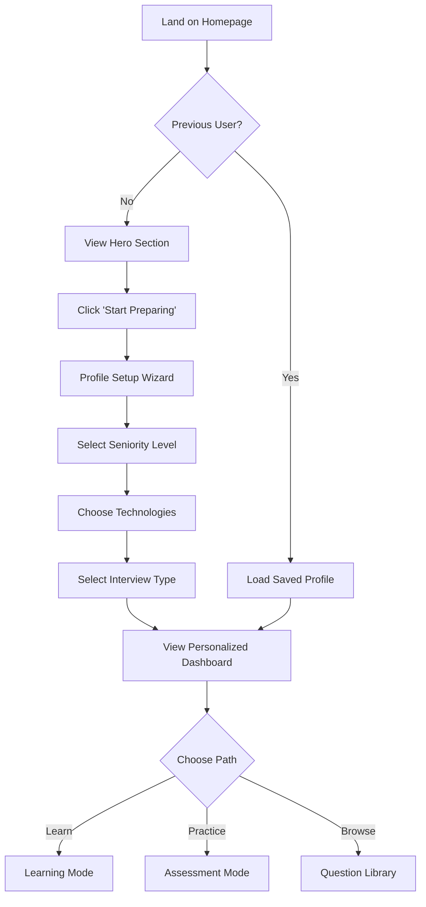
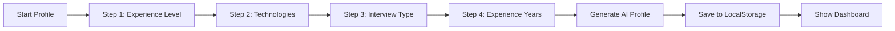
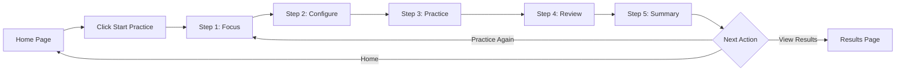

# User Flows & Journey Maps
## DevPrep AI - User Experience Design

### Version 2.0.0 | October 2025
**Status**: ✅ MVP Complete - Phase 4 Done

---

## 1. Overview

This document defines the key user journeys through DevPrep AI, mapping each interaction point and designing for optimal user experience. Each flow prioritizes simplicity and minimal friction.

---

## 2. User Flow Diagrams

### 2.1 First-Time User Journey



### 2.2 Profile Creation Flow



---

## 3. Practice Wizard Flow (Implemented - Phase 4)

### 3.1 5-Step Practice Wizard

The core practice experience uses a guided 5-step wizard that walks users through the entire practice session.



#### Step 1: Focus
```
┌─────────────────────────────────┐
│   What would you like to        │
│   focus on today?               │
│                                  │
│   ☐ React Hooks                 │
│   ☐ Performance                 │
│   ☐ Testing                     │
│   ☐ TypeScript                  │
│   ☐ State Management            │
│   ☐ Custom...                   │
│                                  │
│   [Continue →]                  │
└─────────────────────────────────┘
```
**Interactions**:
- Multi-select checkboxes
- Minimum 1 focus area required
- Can add custom focus areas
- Validates selection before proceeding

#### Step 2: Configure
```
┌─────────────────────────────────┐
│   Configure Your Practice       │
│                                  │
│   Difficulty: ●●●○○ (3)        │
│   [Slider: 1-5]                 │
│                                  │
│   Number of Questions: 5        │
│   [Dropdown: 3, 5, 10, 15]     │
│                                  │
│   Technologies:                 │
│   ☑ React  ☑ TypeScript        │
│   ☐ Node.js  ☐ Next.js         │
│                                  │
│   [← Back] [Generate Questions →]│
└─────────────────────────────────┘
```
**Interactions**:
- Difficulty slider (1-5)
- Question count dropdown
- Technology multi-select
- "Generate Questions" triggers Claude API call
- Loading state with progress indicator

#### Step 3: Practice
```
┌─────────────────────────────────┐
│   Question 2 of 5               │
│   ━━━━━━━━●●●●●━━              │
│                                  │
│   [Question Display]            │
│   "Implement a debounced..."   │
│                                  │
│   [Code Editor with Syntax      │
│    Highlighting]                │
│   > function debounce...        │
│                                  │
│   [← Previous] [Skip] [Next →] │
└─────────────────────────────────┘
```
**Interactions**:
- CodeMirror editor for coding questions
- Text area for conceptual questions
- Navigation: Previous, Skip, Next
- Auto-save answers to Zustand store
- Progress indicator
- Can skip questions (marked for review)

#### Step 4: Review
```
┌─────────────────────────────────┐
│   Review Your Answers           │
│                                  │
│   Question 1: ✓ Answered       │
│   Question 2: ✓ Answered       │
│   Question 3: ⚠ Skipped        │
│   Question 4: ✓ Answered       │
│   Question 5: ○ Not Answered   │
│                                  │
│   [Edit Answers] [Submit All →]│
└─────────────────────────────────┘
```
**Interactions**:
- Shows completion status for each question
- Can click to edit specific answers
- "Submit All" triggers batch evaluation
- Confirm dialog before submission
- Loading state during AI evaluation

#### Step 5: Summary
```
┌─────────────────────────────────┐
│   Practice Session Complete!    │
│                                  │
│   📊 Overall Score: Good        │
│   ✓ 4/5 Questions Completed    │
│   ⏱ Time: 23 minutes           │
│                                  │
│   [Detailed Results]            │
│   [Practice Again] [Home]       │
└─────────────────────────────────┘
```
**Interactions**:
- Summary statistics
- Option to view detailed feedback
- Start new practice session
- Return to home page
- Save results to localStorage

---

## 4. Detailed User Flows

### 4.1 Onboarding Flow (Legacy - Pre-Phase 4)

#### Entry Point
- **URL**: `/` or `/start`
- **Trigger**: First visit or "Start Preparing" CTA

#### Steps

##### Step 1: Welcome Screen
```
┌─────────────────────────────────┐
│       Welcome to DevPrep AI     │
│                                  │
│   AI-Powered Interview Prep     │
│                                  │
│   [Start Preparing] (Primary)   │
│   [Browse Questions] (Secondary)│
└─────────────────────────────────┘
```

**Interactions**:
- Primary CTA: Begins profiling
- Secondary: Skip to browse mode
- Auto-save: Check localStorage for existing profile

##### Step 2: Seniority Selection
```
┌─────────────────────────────────┐
│   What's your experience level? │
│                                  │
│   ┌─────┐ ┌─────┐ ┌─────┐      │
│   │Junior│ │ Mid │ │Senior│     │
│   └─────┘ └─────┘ └─────┘      │
│   ┌─────┐ ┌──────┐              │
│   │Staff│ │Tech  │              │
│   └─────┘ │Lead  │              │
│           └──────┘              │
│                                  │
│   [Back] [Continue →]           │
└─────────────────────────────────┘
```

**Interactions**:
- Single selection required
- Visual feedback on hover/selection
- Tooltip with years of experience guide
- Progressive disclosure of next step

##### Step 3: Technology Stack
```
┌─────────────────────────────────┐
│   Which technologies?           │
│                                  │
│   Frontend                      │
│   ☑ React  ☐ Vue  ☐ Angular    │
│   ☑ TypeScript  ☐ JavaScript   │
│                                  │
│   Backend                       │
│   ☐ Node.js  ☐ Python  ☐ Go    │
│                                  │
│   Other                         │
│   ☐ System Design  ☐ Algorithms│
│                                  │
│   [← Back] [Continue →]         │
└─────────────────────────────────┘
```

**Interactions**:
- Multiple selection allowed
- Grouped by category
- Smart defaults based on seniority
- Minimum 1 selection required

##### Step 4: Interview Type
```
┌─────────────────────────────────┐
│   What type of interview?       │
│                                  │
│   ┌──────────────┐              │
│   │ 🧑‍💻 Technical │              │
│   │ Coding & Problem Solving    │
│   └──────────────┘              │
│                                  │
│   ┌──────────────┐              │
│   │ 🗣️ Behavioral │              │
│   │ Soft Skills & Experience   │
│   └──────────────┘              │
│                                  │
│   ┌──────────────┐              │
│   │ 🏗️ System Design │           │
│   │ Architecture & Scale        │
│   └──────────────┘              │
│                                  │
│   [← Back] [Get Started →]      │
└─────────────────────────────────┘
```

**Interactions**:
- Multiple selection allowed
- Icons for visual clarity
- Descriptions for context
- Final CTA changes to "Get Started"

### 3.2 Learning Mode Flow

#### Entry Point
- **URL**: `/learn`
- **Trigger**: Dashboard card or navigation

#### Question Selection
```
┌─────────────────────────────────┐
│   Choose a Topic                │
│                                  │
│   React Fundamentals            │
│   ┌──────────────┐              │
│   │ Hooks        │ 12 questions │
│   │ ⚫⚫⚫⚪⚪     │              │
│   └──────────────┘              │
│                                  │
│   ┌──────────────┐              │
│   │ Performance  │ 8 questions  │
│   │ ⚫⚫⚪⚪⚪     │              │
│   └──────────────┘              │
│                                  │
│   ┌──────────────┐              │
│   │ Testing      │ 10 questions │
│   │ ⚪⚪⚪⚪⚪     │ NEW!        │
│   └──────────────┘              │
└─────────────────────────────────┘
```

#### Learning Interface
```
┌─────────────────────────────────┐
│ Question 3 of 12    [Progress Bar]│
├─────────────────────────────────┤
│                                  │
│ What is the purpose of useEffect?│
│                                  │
│ [Think About It]                │
│                                  │
│ ┌─ Hidden Answer ──────────────┐ │
│ │ Click to reveal...            │ │
│ └───────────────────────────────┘ │
│                                  │
│ ┌─ Code Example ───────────────┐ │
│ │ Click to view...              │ │
│ └───────────────────────────────┘ │
│                                  │
│ [← Previous] [Skip] [Next →]    │
└─────────────────────────────────┘
```

**Progressive Disclosure**:
1. Question presented
2. User thinks (optional timer)
3. Reveal answer
4. Show code example
5. Display best practices
6. Navigate to next

### 3.3 Assessment Mode Flow

#### Setup Phase
```
┌─────────────────────────────────┐
│   Configure Your Assessment     │
│                                  │
│   Duration                      │
│   ○ 15 minutes (5 questions)    │
│   ● 30 minutes (10 questions)   │
│   ○ 45 minutes (15 questions)   │
│                                  │
│   Difficulty                    │
│   [====|--------] Balanced      │
│                                  │
│   Topics (optional)             │
│   ☑ All Topics                  │
│                                  │
│   [Cancel] [Start Assessment →] │
└─────────────────────────────────┘
```

#### Active Assessment
```
┌─────────────────────────────────┐
│ ⏱️ 27:43         Question 2/10  │
├─────────────────────────────────┤
│                                  │
│ Optimize this React component   │
│ for performance:                │
│                                  │
│ ```jsx                          │
│ function List({ items }) {      │
│   return items.map(item =>      │
│     <Item key={item.id} {...}   │
│   );                            │
│ }                               │
│ ```                             │
│                                  │
│ [Text area for answer]          │
│                                  │
│ [Get Hint -1 point]             │
│                                  │
│ [← Back] [Skip] [Submit →]      │
└─────────────────────────────────┘
```

#### Results View
```
┌─────────────────────────────────┐
│   Assessment Complete! 🎉       │
│                                  │
│   Overall Performance           │
│   ████████░░ 78%               │
│                                  │
│   Strengths                     │
│   • React Hooks (90%)           │
│   • Component Design (85%)      │
│                                  │
│   Areas to Improve              │
│   • Performance (60%)           │
│   • Testing (65%)               │
│                                  │
│   Time: 28:15 / 30:00          │
│   Questions: 9 / 10             │
│                                  │
│   [View Details] [Try Again]    │
└─────────────────────────────────┘
```

### 3.4 Progress Dashboard Flow

```
┌─────────────────────────────────┐
│   Your Progress                 │
│                                  │
│   📊 Stats This Week            │
│   ┌────────┐ ┌────────┐        │
│   │   42   │ │   12   │        │
│   │Questions│ │ Hours  │        │
│   └────────┘ └────────┘        │
│                                  │
│   🔥 Current Streak: 5 days     │
│                                  │
│   📈 Skill Radar                │
│   [Radar Chart Visualization]   │
│                                  │
│   📚 Recent Activity            │
│   • Completed React Hooks       │
│   • Assessment: 85%             │
│   • Studied Performance         │
│                                  │
│   [Continue Learning →]         │
└─────────────────────────────────┘
```

---

## 4. Interaction Patterns

### 4.1 Navigation

#### Primary Navigation
- **Home**: Logo click, always accessible
- **Learn**: Main nav item
- **Practice**: Main nav item
- **Progress**: User avatar/icon

#### Breadcrumbs
```
Home > Learn > React Hooks > Question 3
```

### 4.2 Feedback Mechanisms

#### Loading States
```
┌─────────────────────────────────┐
│                                  │
│     Generating questions...     │
│     [Loading animation]         │
│                                  │
└─────────────────────────────────┘
```

#### Success States
```
✅ Answer submitted successfully!
```

#### Error States
```
⚠️ Could not load questions. Please try again.
[Retry] [Go Back]
```

### 4.3 Micro-interactions

| Element | Interaction | Animation |
|---------|------------|-----------|
| Buttons | Hover | Scale 1.05, shadow |
| Cards | Click | Press depth effect |
| Progress | Update | Smooth fill animation |
| Reveals | Open | Slide down with fade |
| Navigation | Switch | Slide transition |

---

## 5. Mobile Flows

### 5.1 Mobile Adaptations

#### Bottom Navigation
```
┌─────────────────────────────────┐
│         Main Content            │
│                                  │
│                                  │
├─────────────────────────────────┤
│  🏠    📚    ✍️    📊    👤    │
│ Home  Learn Test Progress Profile│
└─────────────────────────────────┘
```

#### Swipe Gestures
- **Left/Right**: Navigate questions
- **Up**: Reveal answer
- **Down**: Hide answer

#### Touch Optimizations
- Minimum touch target: 44x44px
- Increased spacing between elements
- Larger text (16px minimum)
- Bottom sheet for options

### 5.2 Responsive Breakpoints

| Breakpoint | Layout Changes |
|------------|---------------|
| < 640px | Single column, bottom nav |
| 640-1024px | Two columns where applicable |
| > 1024px | Full desktop layout |

---

## 6. Accessibility Flows

### 6.1 Keyboard Navigation

| Key | Action |
|-----|--------|
| Tab | Next focusable element |
| Shift+Tab | Previous element |
| Enter/Space | Activate button/link |
| Arrow Keys | Navigate options |
| Escape | Close modal/dropdown |

### 6.2 Screen Reader Support

- Semantic HTML structure
- ARIA labels for icons
- Live regions for updates
- Skip navigation links
- Focus management

---

## 7. Edge Cases & Error Flows

### 7.1 Network Issues

```
Flow: Question Loading Failure
1. User clicks "Next Question"
2. API request fails
3. Show inline error message
4. Offer retry with exponential backoff
5. After 3 failures, show offline mode option
```

### 7.2 Session Recovery

```
Flow: Interrupted Assessment
1. User loses connection mid-assessment
2. Answers saved to localStorage every 30s
3. On reconnection, prompt to resume
4. Restore timer and progress
5. Continue from last answered question
```

### 7.3 Empty States

#### No Questions Available
```
┌─────────────────────────────────┐
│                                  │
│     No questions found 😕       │
│                                  │
│  Try adjusting your filters or  │
│  selecting different topics      │
│                                  │
│    [Browse All Questions]       │
│                                  │
└─────────────────────────────────┘
```

---

## 8. User Flow Metrics

### 8.1 Key Performance Indicators

| Flow | Success Metric | Target |
|------|---------------|--------|
| Onboarding | Completion rate | > 80% |
| First Question | Time to first question | < 2 min |
| Assessment | Completion rate | > 70% |
| Return Visit | 7-day retention | > 40% |

### 8.2 Drop-off Points

Monitor and optimize:
1. Profile step 3 (Technology selection)
2. First question reveal
3. Assessment setup
4. Results page actions

---

## 9. A/B Testing Opportunities

### 9.1 Onboarding Variations

#### Test A: Progressive Disclosure
- Show one question at a time
- Smooth transitions between steps

#### Test B: Single Page Form
- All questions visible
- Sections expand as completed

### 9.2 Learning Mode Variations

#### Test A: Immediate Reveal
- Answer visible by default
- Focus on learning speed

#### Test B: Delayed Reveal
- Force thinking time
- Track engagement depth

---

## 10. Future Flow Enhancements

### 10.1 Phase 2 Additions
- Social features (share progress)
- Collaborative learning
- Mentor matching
- Live mock interviews

### 10.2 Gamification Elements
- Achievement badges
- Leaderboards
- Daily challenges
- Skill trees

---

## 11. Flow Documentation

### 11.1 Component Mapping

| Flow Step | Component | File Path |
|-----------|-----------|-----------|
| Onboarding | ProfileWizard | /components/forms/ProfileWizard.tsx |
| Question View | QuestionCard | /components/features/QuestionCard.tsx |
| Assessment | AssessmentFlow | /components/assessment/AssessmentFlow.tsx |
| Results | ResultsDisplay | /components/assessment/ResultsDisplay.tsx |

### 11.2 State Management

```typescript
// User flow state structure
interface FlowState {
  currentStep: number;
  completedSteps: number[];
  flowType: 'onboarding' | 'learning' | 'assessment';
  startTime: Date;
  interactions: UserInteraction[];
}
```

---

*Last Updated: October 8, 2025*
*Version: 2.0.0*
*Status: MVP Complete - Phase 4 Implementation Done*